# java面试基础题

# 说说Java的集合类

这题一般用在开头，让你热热身，你也不需要说的那么详细，大致讲下，面试官会根据你回答的点继续挖的。

Java集合从分类上看，有 collection 和 map 两种，前者是存储对象的集合类，后者存储的是键值对（key-value）


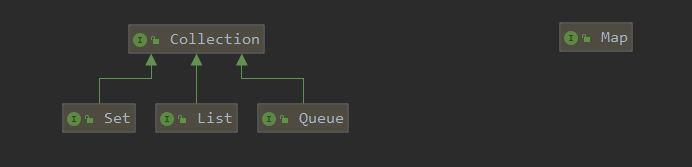

## Collection

### Set

主要功能是保证存储的集合不会重复，至于集体是有序还是无序的，需要看具体的实现类，比如 TreeSet 就是有序的，HashSet 是无序的（所以网上有些说 set 是无序集合是在扯淡）

### List

这个很熟悉，具体的实现类有 ArrayList 和 LinkedList，两者的区别在于底层实现不同，前者是数组，后者是双向链表，所以引申出来就是将数组和链表的区别。

#### 数组 VS 链表

数组的内存是连续的，且存储的元素大小是固定的，实现上是基于一个内存地址，然后由于元素固定大小，支持利用下标的直接访问。

具体是通过`下标 * 元素大小+内存基地址`算出一个访问地址，然后直接访问，所以随机访问的效率很高，O(1)。


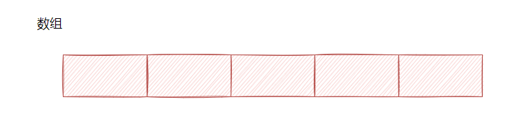


而由于要保持内存连续这个特性，不能在内存中间空一块，所以删除中间元素时就需要搬迁元素，需进行内存拷贝，所以说删除的效率不高。

链表的内存不需要连续，它们是通过指针相连，这样对内存的要求没那么高（数组的申请需要一块连续的内存），链表就可以散装内存，不过链表需要额外存储指针，所以总体来说，链表的占用内存会大一些。

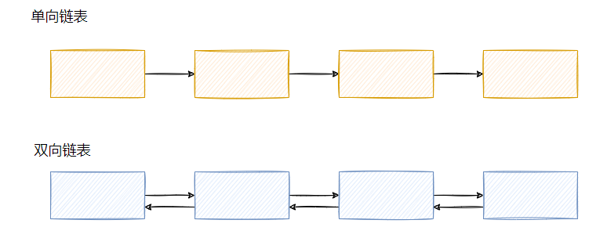

且由于是指针相连，所以直接无法随机访问一个元素，必须从头（如双向链表，可尾部）开始遍历，所以随机查找的效率不高，O(n)。

也由于指针相连这个特性，单方面删除的效率高，因为只需要改变指针即可，没有额外的内存拷贝动作(但是要找到这个元素，费劲儿呀，除非你顺序遍历删)。

> 两者大致的特点就如上所说，再扯地深一点，就要说到 CPU 亲和性问题

各位应该都听过空间局部性。

空间局部性（spatial locality）：如果一个存储器的位置被引用，那么将来它附近的位置也会被引用。

根据这个原理，就会有预读功能，像 CPU 缓存就会读连续的内存，这样一来如果你本就要遍历数组的，那么你后面的数据就已经被上一次读取前面数据的时候，一块被加载了，这样就是 CPU 亲和性高。

反观链表，由于内存不连续，所以预读不到，所以 CPU 亲和性低。

对了，链表（数组）加了点约束的话，还可以用作栈、队列和双向队列。

像 LinkedList 就可以用来作为栈或者队列使用。

### queue

队列，有序，严格遵守先进先出，就像往常的排队，没啥别的好说的。

常用的实现类就是 LinkedList，没错这玩意还实现了 Queue 接口。

还有一个值得一提的是优先队列，即 PriorityQueue，内部是基于数组构建的，用法就是你自定义一个 comparator ，自己定义对比规则，这个队列就是按这个规则来排列出队的优先级。

## Map

存储的是键值对，也就是给对象（value）搞了一个 key，这样通过 key 可以找到那个 value。

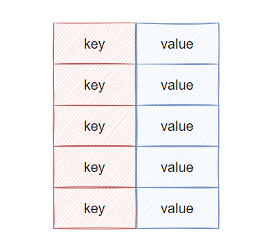

最出名的，平日里使用最多的应该就是 HashMap，这个是无序的。

还有两个实现类，LinkedHashMap 和 TreeMap，前者里面搞了个链表，这样塞入顺序就被保存下来了，后者是红黑树实现了，所以有序。

最后还有个 IdentityHashMap ，这个好像网上文章都提的比较少，不过我们也来盘一下，有备无患。

### HashMap

这玩意是面试高频点，可以说几乎被问烂了... 有的题目还很刁难，比如问默认初始容量（16）是多少，哈希函数怎么设计的..没点准备肯定蒙，所以我们来个一网打尽。

### 能说下 HashMap 的实现原理吗

其实就是有个 Entry 数组，Entry 保存了 key 和 value。当你要塞入一个键值对的时候，会根据一个 hash 算法计算 key 的 hash 值，然后通过数组大小 n-1 & hash 值之后，得到一个数组的下标，然后往那个位置塞入这个 Entry。

然后我们知道，hash 算法是可能产生冲突的，且数组的大小是有限的，所以很可能通过不同的 key 计算得到一样的下标，因此为了解决 Entry 冲突的问题，采用了链表法，如下图所示：

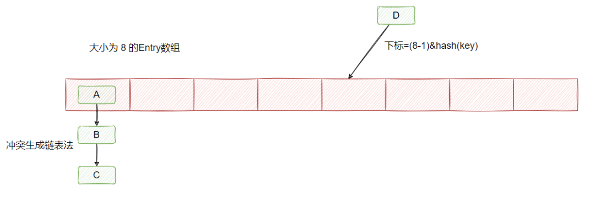

在 JDK1.7 及之前链表的插入采用的是头插法，即在链表的头部插入新的 Entry。

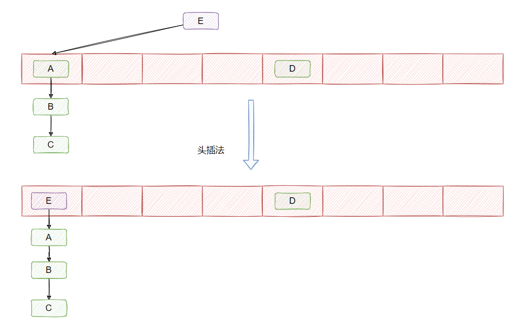

在 JDK1.8 的时候，改成了尾插法，并且引入了红黑树。

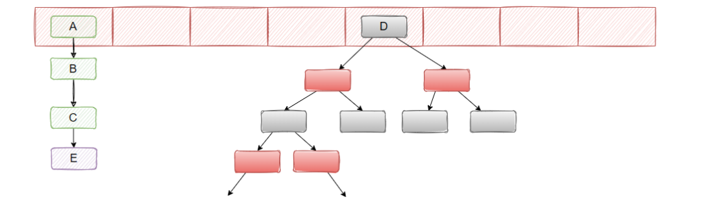

当链表的长度大于 8 且数组大小大于等于 64 的时候，就把链表转化成红黑树，当红黑树节点小于 6 的时候，又会退化成链表。

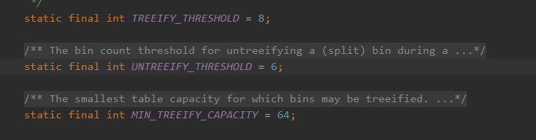

### 为什么 JDK 1.8 要对 HashMap 做红黑树这个改动？

主要是避免 hash 冲突导致链表的长度过长，这样 get 的时候时间复杂度严格来说就不是 O(1) 了，因为可能需要遍历链表来查找命中的 Entry。

#### 为什么定义链表长度为 8 且数组大小大于等于 64 才转红黑树？不要链表直接用红黑树不就得了吗？

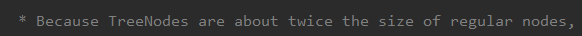

因为**红黑树节点的大小是普通节点大小的两倍**，所以为了节省内存空间不会直接只用红黑树，只有当节点到达一定数量才会转成红黑树，这里定义的是 8。

为什么是 8 呢？这个其实 HashMap 注释上也有说的，和泊松分布有关系，这个大学应该都学过。

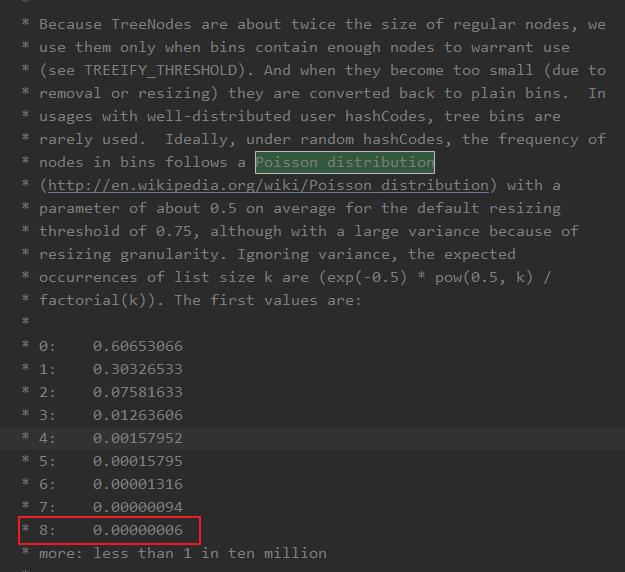

简单翻译下就是在默认阈值是 0.75 的情况下，冲突节点长度为 8 的概率为 0.00000006，也就概率比较小（毕竟红黑树耗内存，且链表长度短点时遍历的还是很快的）。

这就是基于时间和空间的平衡了，红黑树占用内存大，所以节点少就不用红黑树，如果万一真的冲突很多，就用红黑树，选个参数为 8 的大小，就是为了平衡时间和空间的问题。

#### 为什么节点少于 6 要从红黑树转成链表？

也是为了平衡时间和空间，节点太少链表遍历也很快，没必要成红黑树，变成链表节约内存。

为什么定了 6 而不是小于等于 8 就变？

是因为要**留个缓冲余地**，避免反复横跳。举个例子，一个节点反复添加，从 8 变成 9 ，链表变红黑树，又删了，从 9 变成 8，又从红黑树变链表，再添加，又从链表变红黑树？

所以余一点 ，毕竟树化和反树化都是有开销的。

### 那 JDK 1.8 对 HashMap 除了红黑树这个改动，还有哪些改动？

1. hash 函数的优化
2. 扩容 rehash 的优化
3. 头插法和尾插法
4. 插入与扩容时机的变更

#### hash 函数的优化

1.7是这样实现的：

```
static int hash(int h) {
    h ^= (h >>> 20) ^ (h >>> 12);
    return h ^ (h >>> 7) ^ (h >>> 4);
}
```

而 1.8 是这样实现的：

```
    static final int hash(Object key) {
        int h;
        return (key == null) ? 0 : (h = key.hashCode()) ^ (h >>> 16);
    }
```

具体而言就是 1.7 的操作太多了，经历了四次异或，所以 1.8 优化了下，它将 key 的哈希码的高16位和低16位进行了异或，得到的 hash 值同时拥有了高位和低位的特性，这样做得出的码比较均匀，不容易冲突。

这也是 JDK 开发者根据速度、实用性、哈希质量所做的权衡来做的实现：

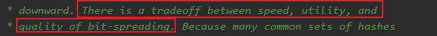

#### 扩容 rehash 的优化

按照我们的思维，正常扩容肯定是先申请一个更大的数组，然后将原数组里面的每一个元素重新 hash 判断在新数组的位置，然后一个一个搬迁过去。

在 1.7 的时候就是这样实现的，然而 1.8 在这里做了优化，**关键点就在于数组的长度是 2 的次方，且扩容为 2 倍**。

因为数组的长度是 2 的 n 次方，所以假设以前的数组长度（16）二进制表示是 01000，那么新数组的长度（32）二进制表示是 10000，这个应该很好理解吧？

它们之间的差别就在于高位多了一个 1，而我们通过 key 的 hash 值定位其在数组位置所采用的方法是 `(数组长度-1) & hash`。我们还是拿 16 和 32 长度来举例：

16-1=15，二进制为 00111

32-1=31，二进制为 01111

所以重点就在 key 的 hash 值的从左往右数第四位是否是 1，如果是 1 说明需要搬迁到新位置，且新位置的下标就是原下标+16（原数组大小），如果是 0 说明吃不到新数组长度的高位，那就还是在原位置，不需要迁移。

所以，我们刚好拿老数组的长度（01000）来判断高位是否是 1，这里只有两种情况，要么是 1 要么是 0  。

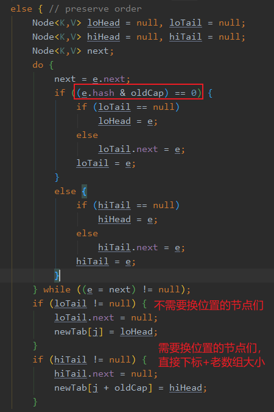

从上面的源码可以看到，链表的数据是一次性计算完，然后一堆搬运的，因为扩容时候，节点的下标变化只会是原位置，或者原位置+老数组长度，不会有第三种选择。

上面的位操作，包括为什么是原下标+老数组长度等，如果你不理解的话，可以举几个数带进去算一算，就能理解了。

总结一下，1.8 的扩容不需要每个节点重写 hash 算下标，而是通过和老数组长度的**&**计算是否为 0 ，来判断新下标的位置。

额外再补充一个问题：**为什么 HashMap 的长度一定要是 2 的 n 次幂？**

原因就在于数组下标的计算，由于下标的计算公式用的是 `i = (n - 1) & hash`，即位运算，一般我们能想到的是 %（取余）计算，但相比于位运算而言，效率比较低，所以推荐用位运算，而要满足上面这个公式，n 的大小就必须是 2 的 n 次幂。

即：**当 b 等于 2 的 n 次幂时，a % b 操作等于 a & ( b - 1 )**

#### 头插法和尾插法

1.7是头插法，上面的图已经展示了。

头插法的好处就是插入的时候不需要遍历链表，直接替换成头结点，但是缺点是扩容的时候会逆序，而逆序在多线程操作下可能会出现环，然后就死循环了。

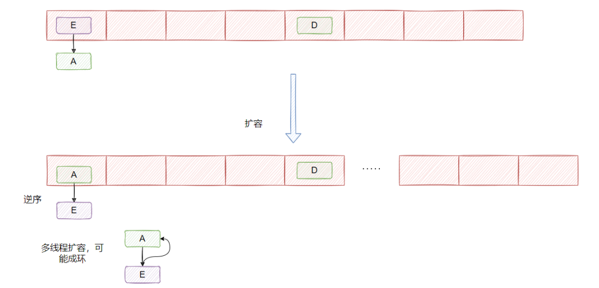

然后 1.8 是尾插法，每次都从尾部插入的话，扩容后链表的顺序还是和之前一致，所以不可能出现多线程扩容成环的情况。

其实我在网上找了找，很多文章说尾插法的优化就是避免多线程操作成环的问题，我表示怀疑。因为 HashMap 本就不是线程安全的，我要还优化你多线程的情况？我觉得开发者应该不会做这样的优化。

那为什么要变成尾插法呢？我也没找到官方解答，如果有谁知道可以教我一下。

那再延伸一下，**改成尾插法之后 HashMap 就不会死循环了吗？**

好像还是会，这次是红黑树的问题 ，我在网上看到这篇文章，有兴趣的可以深入了解下

- *https://blog.csdn.net/qq_33330687/article/details/101479385*

#### 插入与扩容时机的变更

1.7 是先判断 put 的键值对是新增还是替换，如果是替换则直接替换，如果是新增会判断当前元素数量是否大于等于阈值，如果超过阈值且命中数组索引的位置已经有元素了，那么就进行扩容。

```
    if ((size >= threshold) && (null != table[bucketIndex])) {
        resize(2 * table.length);
        hash = (null != key) ? hash(key) : 0;
        bucketIndex = indexFor(hash, table.length);
    }
    createEntry(...)
```

所以 1.7 是先扩容，然后再插入。

而 1.8 则是先插入，然后再判断 size 是否大于阈值，若大于则扩容。

就这么个差别，至于为什么，好吧，我查了下没查出来，我自己也不知道，我个人觉得两者没差。。可能是重构（引入红黑树）的时候改了下顺序而已...其实没什么影响，我自己也脑补不出什么别的了。

网上也没找到什么比较有信服力的答案，所以如果有谁知道可以再教我一下。

HashMap 大概就这么些个点了，建议看下源码，再巩固一下。

### LinkedHashMap

LinkedHashMap 的父类是 HashMap，所以 HashMap 有的它都有，然后基于 HashMap 做了一些扩展。

首先它把 HashMap 的 Entry 加了两个指针：before 和 after。

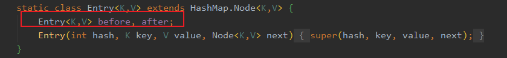

这目的已经很明显了，就是要把塞入的 Entry 之间进行关联，串成双向链表，如下图红色的就是新增的两个指针

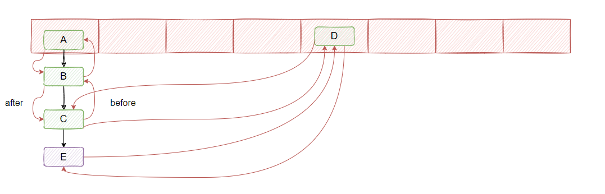

并且内部还有个  accessOrder 成员，默认是 false， 代表链表是顺序是按插入顺序来排的，如果是 true 则会根据访问顺序来进行调整，就是咱们熟知的 LRU 那种，如果哪个节点访问了，就把它移到最后，代表最近访问的节点。

具体实现其实就是 HashMap 埋了几个方法，然后 LinkedHashMap 实现了这几个方法做了操作，比如以下这三个，从方法名就能看出了：访问节点之后干啥；插入节点之后干啥；删除节点之后干啥。

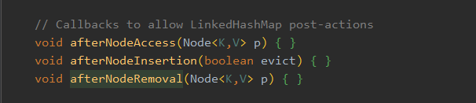

举个 afterNodeInsertion 的例子，它埋在 HashMap 的 put 里，在塞入新节点之后，会调用这个方法

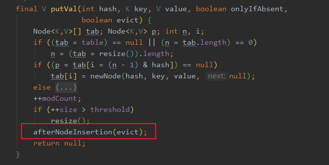

然后 LinkedHashMap 实现了这个方法，**可以看到这个方法主要用来移除最老的节点**。

看到这你能想到啥？假如你想用 map 做个本地缓存，由于缓存的数量不可能无限大，所以你就能**继承** LinkedHashMap 来实现，当节点超过一定数量的时候，在插入新节点的同时，移除最老最久没有被访问的节点，这样就实现了一个 LRU 了。

具体做法是把 accessOrder 设置为  true，这样每次访问节点就会把刚访问的节点移动到尾部，然后再重写 removeEldestEntry 方法，LinkedHashMap 默认的实现是直接返回 true。

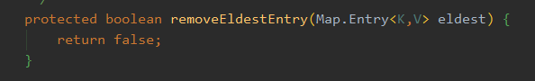

你可以搞个：

```
 protected boolean removeEldestEntry(Entry<K, V> eldest) {
       return this.size() > this.maxCacheSize;
   }
```

这样就简单的实现一个 LRU 了！下面展示下完整的代码，非常简单：

```
    private static final class LRUCache<K, V> extends LinkedHashMap<K, V> {
        private final int maxCacheSize;

        LRUCache(int initialCapacity, int maxCacheSize) {
            super(initialCapacity, 0.75F, true);
            this.maxCacheSize = maxCacheSize;
        }

        protected boolean removeEldestEntry(Map.Entry<K, V> eldest) {
            return this.size() > this.maxCacheSize;
        }
    }
```

这里还能引申出一个笔试题，手写实现一个 LRU 算法，来我给你写！

```
public class LRUCache<K,V> {
    class Node<K,V> {
        K key;
        V value;
        Node<K,V> prev, next;
        public Node(){}
        public Node(K key, V value) {
            this.key = key;
            this.value = value;
        }
    }
    private int capacity;
    private HashMap<K,Node> map;
    private Node<K,V> head;
    private Node<K,V> tail;
    public LRUCache(int capacity) {
        this.capacity = capacity;
        map = new HashMap<>(capacity);
        head = new Node<>();
        tail = new Node<>();
        head.next = tail;
        tail.prev = head;
    }

    public V get(K key) {
        Node<K,V> node = map.get(key);
        if (node == null) {
            return null;
        }
        moveNodeToHead(node);
        return node.value;
    }

    public void put(K key, V value) {
         Node<K,V> node = map.get(key);
       if (node == null) {
            if (map.size() >= capacity) {
                map.remove(tail.prev.key);
                removeTailNode();
            }
            Node<K,V> newNode = new Node<>(key, value);
            map.put(key, newNode);
            addToHead(newNode);
        } else {
            node.value = value;
            moveNodeToHead(node);
        }
    }

    private void addToHead(Node<K,V> newNode) {
        newNode.prev = head;
        newNode.next = head.next;
        head.next.prev = newNode;
        head.next = newNode;
    }

    private void moveNodeToHead(Node<K,V> node) {
        removeNode(node);
        addToHead(node);
    }

    private void removeNode(Node<K,V> node) {
        node.prev.next = node.next;
        node.next.prev = node.prev;
    }

    private void removeTailNode() {
        removeNode(tail.prev);
    }

    public static void main(String[] args) {
        LRUCache<Integer,Integer> lruCache = new LRUCache<>(3);
        lruCache.put(1,1);
        lruCache.put(2,2);
        lruCache.put(3,3);
        lruCache.get(1);
        lruCache.put(4,4);
        System.out.println(lruCache); // toString 我就没贴了，代码太长了
    }
}
```

### TreeMap

TreeMap 内部是通过红黑树实现的，可以让 key 的实现 Comparable 接口或者自定义实现一个 comparator 传入构造函数，这样塞入的节点就会根据你定义的规则进行排序。

这个用的比较少，我常用在跟加密有关的时候，有些加密需要根据字母序排，然后再拼接成字符串排序，在这个时候就可以把业务上的值统一都塞到 TreeMap 里维护，取出来就是有序的。

具体就不深入了，一般不会问太多。

### IdentityHashMap

理解这个 map 的关键就在于它的名字 Identity，也就是它判断是否相等的依据不是靠 equals ，而是对象本身是否是它自己。

什么意思呢？

首先看它覆盖的 hash 方法：

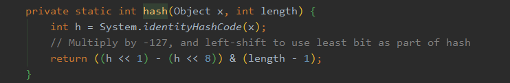

可以看到，它用了个 `System.identityHashCode(x)`，而不是x.hashCode()。

而这个方法会返回原来默认的 hashCode 实现，不管对象是否重写了 hashCode 方法

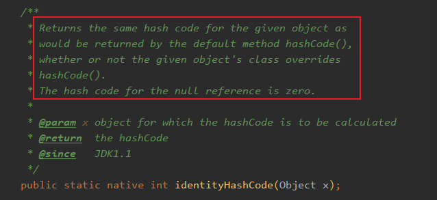

默认的实现返回的值是：**对象的内存地址转化成整数**，是不是有点感觉了？

然后我们再看下它的 get 方法：

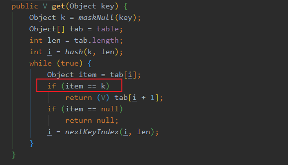

可以看到，**它判断 key 是否相等并不靠 hash 值和 equals，而是直接用了 == 。**

而 **== 其实就是地址判断**！

只有相同的对象进行 == 才会返回 true。

因此我们得知，**IdentityHashMap 的中的 key 只认它自己（对象本身）**。

即便你伪造个对象，就算值都相等也没用，put 进去 IdentityHashMap 只会多一个键值对，而不是替换，这就是 Identity 的含义。

比如以下代码，identityHashMap 会存在两个 Yes：

```
Map<String, String> identityHashMap = new IdentityHashMap<>();
identityHashMap.put(new Yes("1"), "1");
identityHashMap.put(new Yes("1"), "2");
```

这里眼尖的小伙伴发现，为什么返回值是 `tab[i+1]`?

这是因为 IdentityHashMap 的存储方式有点不一样，它是将 value 存在 key 的后面。

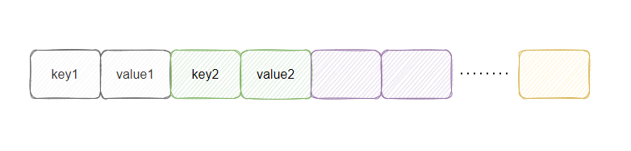

认识到这就差不多了，具体不深入了，有兴趣的小伙伴们自行研究~