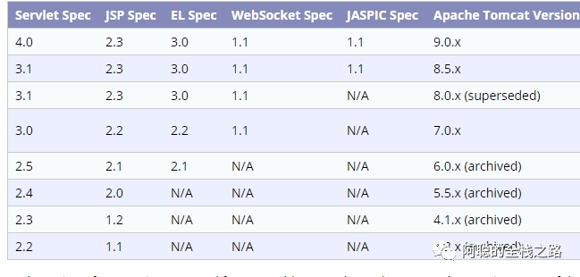
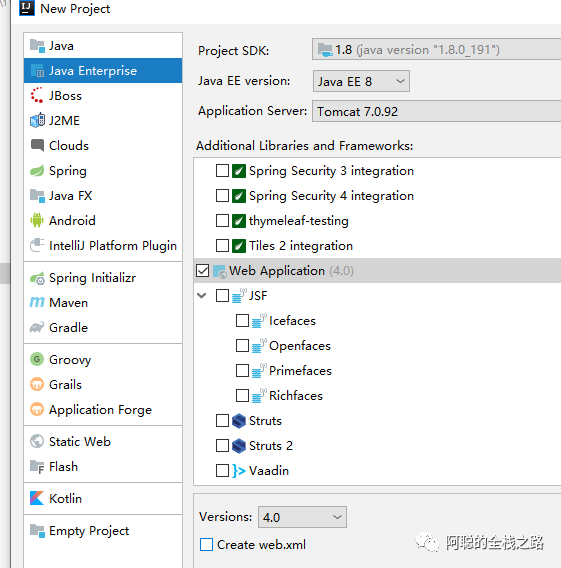
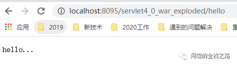
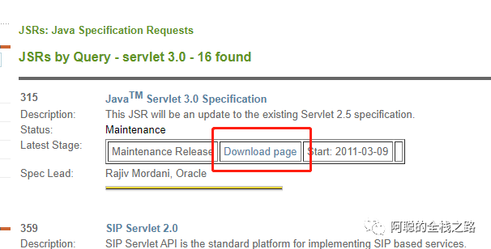
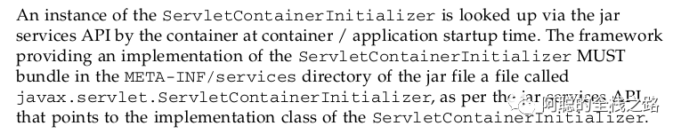
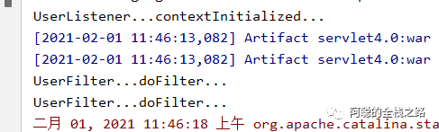
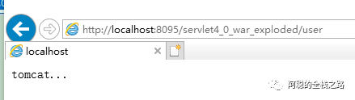
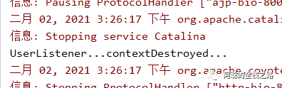

# web 中的servlet 3.0

本文包含以下内容：

1. 注解式项目搭建
2. 查看servlet 的说明书，了解共享库、运行时库
3. 使用ServletContext注册Web组件（Servlet、Filter、Listener）

1.注解式项目搭建

在servlet 3.0 之前，通过web.xml 配置项目

接下来通过注解的方法来配置项目.

可以在 https://www.jcp.org/ 地址查看serlet3.0 标准，并进行文档的下载。

要注意，只有tomcat 7.0 以上才支持servlet 3.0



1. 创建项目，选择java enterprise 勾选 web application 选项，选择本地的tomcat ，并且不勾选生成web.xml 文件 即可；可以参考 https://www.cnblogs.com/wfhking/p/9395774.html

   idea 只支持创建4.0 的 



2.建立index.jsp 作为访问页

```
<%@ page language="java" contentType="text/html; charset=UTF-8"
    pageEncoding="UTF-8"%>
<!DOCTYPE html PUBLIC "-//W3C//DTD HTML 4.01 Transitional//EN" "http://www.w3.org/TR/html4/loose.dtd">
<html>
<head>
<meta http-equiv="Content-Type" content="text/html; charset=UTF-8">
<title>Insert title here</title>
</head>
<body>
  <a href="hello">hello</a>
</body>
</html>
```

3.建立注解注册的servlet 

```

@WebServlet("/hello")
public class HelloServlet extends HttpServlet {

  @Override
  protected void doGet(HttpServletRequest req, HttpServletResponse resp) throws ServletException, IOException {
    // TODO Auto-generated method stub
    //super.doGet(req, resp);
    resp.getWriter().write("hello...");
  }
}
```

4.访问项目地址加上/hello 访问获得servlet 简单项目并获得运行结果如下，到此创建了最基础的web 项目

 



2.查看servlet 的说明书，了解共享库、运行时库

可以通过查看jcp 网站提供的servlet 3.0 的说明文档，在jcp 网站查找servlet 即可获取，也可关注公众号，联系作者获取。

https://www.jcp.org/en/jsr/summary?id=servlet+3.0



1.我们查看到8.2.4章 Shared libraries / runtimes pluggability （共享库与运行时可插拔）



```
大致意思如下：
1、Servlet容器启动会扫描，当前应用里面每一个jar包的
   ServletContainerInitializer的实现
2、提供ServletContainerInitializer的实现类；
   必须绑定在，META-INF/services/javax.servlet.ServletContainerInitializer
   文件的内容就是ServletContainerInitializer实现类的全类名；
总结：容器在启动应用的时候，会扫描当前应用每一个jar包里面
META-INF/services/javax.servlet.ServletContainerInitializer
指定的实现类，启动并运行这个实现类的方法；传入感兴趣的类型；
```

进行代码测试：

1.建立绑定文件：

META-INF/services/javax.servlet.ServletContainerInitializer

内容为

```
com.atguigu.servlet.MyServletContainerInitializer
```

2.创建实现类

```
//容器启动的时候会将@HandlesTypes指定的这个类型下面的子类（实现类，子接口等）传递过来；
//传入感兴趣的类型；
@HandlesTypes(value={HelloService.class})
public class MyServletContainerInitializer implements ServletContainerInitializer {

  /**
   * 应用启动的时候，会运行onStartup方法；
   * 
   * Set<Class<?>> arg0：感兴趣的类型的所有子类型；
   * ServletContext arg1:代表当前Web应用的ServletContext；一个Web应用一个ServletContext；
   * 
   * 1）、使用ServletContext注册Web组件（Servlet、Filter、Listener）
   * 2）、使用编码的方式，在项目启动的时候给ServletContext里面添加组件；
   *     必须在项目启动的时候来添加；
   *     1）、ServletContainerInitializer得到的ServletContext；
   *     2）、ServletContextListener得到的ServletContext；
   */
  @Override
  public void onStartup(Set<Class<?>> arg0, ServletContext sc) throws ServletException {
    // TODO Auto-generated method stub
    System.out.println("感兴趣的类型：");
    for (Class<?> claz : arg0) {
      System.out.println(claz);
    }
  }

}
```

3.通过@HandlesTypes(value={HelloService.class}) 可以导入感兴趣的类，以及其下的子类、实现类、子接口等。所以下面进行一一创建

建立接口

```
public interface HelloService {
}
```

建立子接口

```
public interface HelloServiceExt extends HelloService {
}
```

建立抽象实现类

```
public abstract class AbstractHelloService implements HelloService {
}
```

建立实现类

```
public class HelloServiceImpl implements HelloService {
}
```

运行得到结果如下图所示：获得所有的子类、实现类、子接口等



3.使用ServletContext注册Web组件（Servlet、Filter、Listener）

1.创建Servlet，用于注入测试

```

public class UserServlet extends HttpServlet {

  @Override
  protected void doGet(HttpServletRequest req, HttpServletResponse resp) throws ServletException, IOException {
    // TODO Auto-generated method stub
    resp.getWriter().write("tomcat...");
  }

}
```

2.创建Filter，用于注入测试

```

public class UserServlet extends HttpServlet {

  @Override
  protected void doGet(HttpServletRequest req, HttpServletResponse resp) throws ServletException, IOException {
    // TODO Auto-generated method stub
    resp.getWriter().write("tomcat...");
  }

}
```

3.创建Listener，用于注入测试

```

/**
 * 监听项目的启动和停止
 * @author lfy
 *
 */
public class UserListener implements ServletContextListener {


  //监听ServletContext销毁
  @Override
  public void contextDestroyed(ServletContextEvent arg0) {
    // TODO Auto-generated method stub
    System.out.println("UserListener...contextDestroyed...");
  }

  //监听ServletContext启动初始化
  @Override
  public void contextInitialized(ServletContextEvent arg0) {
    // TODO Auto-generated method stub
    ServletContext servletContext = arg0.getServletContext();
    System.out.println("UserListener...contextInitialized...");
  }

}
```

4.通过onStart 中的webContext 上下文，进行注入

```

//注册组件  ServletRegistration
    ServletRegistration.Dynamic servlet = sc.addServlet("userServlet", new UserServlet());
    //配置servlet的映射信息
    servlet.addMapping("/user");

    //注册Listener
    sc.addListener(UserListener.class);

    //注册Filter  FilterRegistration
    FilterRegistration.Dynamic filter = sc.addFilter("userFilter", UserFilter.class);
    //配置Filter的映射信息
    filter.addMappingForUrlPatterns(EnumSet.of(DispatcherType.REQUEST), true, "/*");
```

5.测试并获得运行结果，可以看到Listener 获取到，启动方法


访问/user 地址：



停止服务器，出发监听器



**-END-**