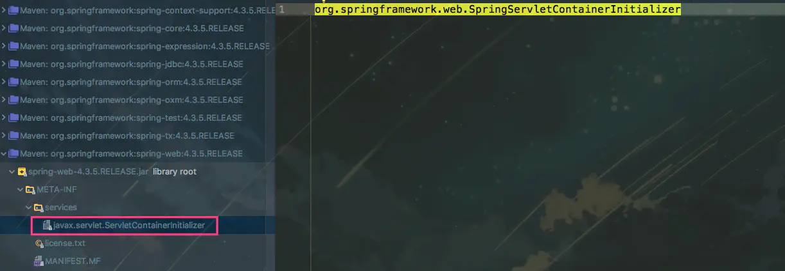
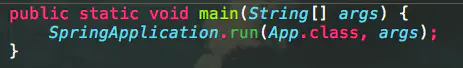
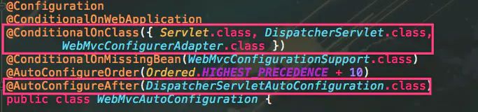
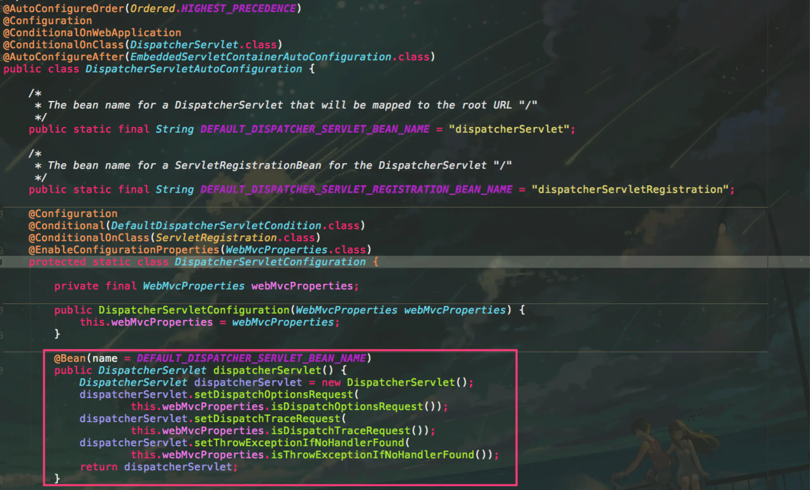
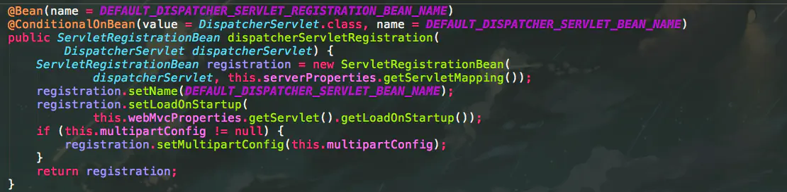

# springboot 省略配置web.xml

## 概述

最开始使用原生的springmvc时，总是免不了有如下xml配置

```
<!-- Spring MVC配置 -->
<!-- ====================================== -->
<servlet>
    <servlet-name>spring</servlet-name>
    <servlet-class>org.springframework.web.servlet.DispatcherServlet</servlet-class>
    <init-param>
        <param-name>contextConfigLocation</param-name>
        <param-value>classpath:spring-servlet.xml</param-value>
    </init-param>
    <load-on-startup>1</load-on-startup>
</servlet>

<servlet-mapping>
    <servlet-name>spring</servlet-name>
    <url-pattern>/*</url-pattern>
</servlet-mapping>
  

<!-- Spring配置 -->
<!-- ====================================== -->
<listener>
   <listenerclass>
 org.springframework.web.context.ContextLoaderListener
   </listener-class>
</listener>
  

<!-- 指定Spring Bean的配置文件所在目录。默认配置在WEB-INF目录下 -->
<context-param>
    <param-name>contextConfigLocation</param-name>
    <param-value>classpath:config/applicationContext.xml</param-value>
</context-param>
```

但是，切换到springboot之后，web.xml之类的繁琐的配置基本上都不见了。出于好奇研究了下springboot究竟帮我们做了什么，我们可以免于这样的繁琐配置。

### Servlet3.0规范

首先研究的第一点，为什么web.xml不见了。刚开始使用原生servlet（不使用web框架），web.xml就是非常重要的一个配置，无论是servlet、filter、listener都需要在web.xml里面配置下。

但是在servlet3.0里，这个配置得到了简化。可以通过java配置（注解等）省去web.xml配置。

具体servlet3.0的规范这里就不讨论了，说下其中一个非常重要的类。**javax.servlet.ServletContainerInitializer**

这个类会在web容器启动阶段被回调，可以在onStartup方法里做一些servlet、filter、listener的注册等操作。

```
/**
Interface which allows a library/runtime to be notified of a web application's startup phase and perform any required programmatic registration of servlets, filters, and listeners in response to it.
*/
public interface ServletContainerInitializer {

    public void onStartup(Set<Class<?>> c, ServletContext ctx)
        throws ServletException; 
}
```

### springboot的实现

首先spring在META-INF/services下配置了这个类，让整个web容器启动后可以找到并启动这个类



ServletContainerInitializer配置

#### SpringServletContainerInitializer

```
/**
* @HandlesTypes这个注解标明了该ServletContainerInitializer需要在启动时候处理哪些类，
然后服务器会把找到的这些类传到onStartup的第一个参数里

注意这里的类包括所配置类的子类，比如这里配置WebApplicationInitializer，
启动之后，就会把这个WebApplicationInitializer的子类都传进去
*/
@HandlesTypes(WebApplicationInitializer.class)
public class SpringServletContainerInitializer implements ServletContainerInitializer {
        
    @Override
    public void onStartup(Set<Class<?>> webAppInitializerClasses, ServletContext servletContext)
            throws ServletException {

        List<WebApplicationInitializer> initializers = new LinkedList<WebApplicationInitializer>();

        //.... 省略容错的一些代码
        initializers.add((WebApplicationInitializer) waiClass.newInstance());
        //.... 
    AnnotationAwareOrderComparator.sort(initializers);
        for (WebApplicationInitializer initializer : initializers) {
            initializer.onStartup(servletContext);
        }
    }

}
```

startup的逻辑很简单，web容器启动后，调用所有WebApplicationInitializer的onStartup方法。

#### WebApplicationInitializer 的实现SpringBootServletInitializer

```
@Override
public void onStartup(ServletContext servletContext) throws ServletException {
   //....
    WebApplicationContext rootAppContext = createRootApplicationContext(
            servletContext);
   //...
}
```

```
protected WebApplicationContext createRootApplicationContext(
        ServletContext servletContext) {
    //...
    return run(application);
}
```

一般使用Springboot的时候，都会继承一个类SpringBootServletInitializer，在这个类的onStartup方法中，启动了整个Spring容器。

本地启动springboot时，我们一般会写一个类似于这样的main方法。

 




上述分析也解释了为啥把springboot应用部署到机器上，tomcat能够找到springboot的入口，并启动它。

### DispatcherServlet的配置

关于springboot如何加载类并启动的这里就不介绍了。
 这里说明下究竟Springboot如何配置DispatcherServlet的

 




1）当类路径下存在DispatcherServlet时候，该配置生效。
 2）这个配置会在DispatcherServletAutoConfiguration配置完之后再配置。

#### DispatcherServletAutoConfiguration配置






看到这里就是我们非常熟悉的springboot的使用了。springboot在*DispatcherServletConfiguration*这个类里对*DispatcherServlet*进行了配置以及注册。

## 总结

服务器如tomcat在web应用启动后，加载并启动springboot，springboot通过@AutoConfiguration、@Bean、@Conditional等注解自动配置了DispatcherServlet。

 

 

 

 

 