# Kafka原理简述

Kafka 是主流的消息流系统，其中的概念还是比较多的，下面通过图示的方式来梳理一下 Kafka 的核心概念，以便在我们的头脑中有一个清晰的认识。

# 基础

Kafka 是一套流处理系统，可以让后端服务轻松的相互沟通，是微服务架构中常用的组件。

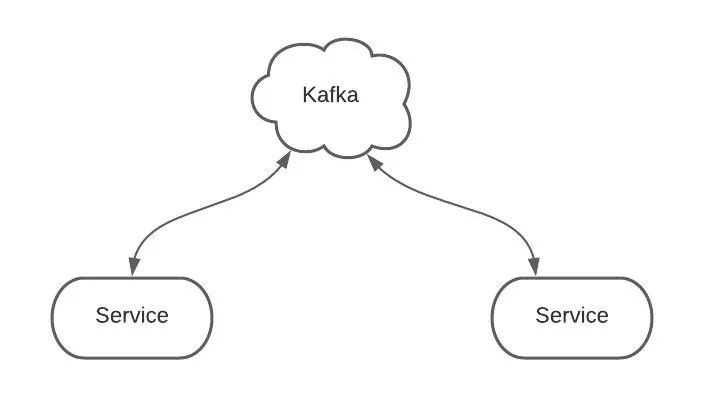

# 生产者消费者

生产者服务 Producer 向 Kafka 发送消息，消费者服务 Consumer 监听 Kafka 接收消息。

一个服务可以同时为生产者和消费者。

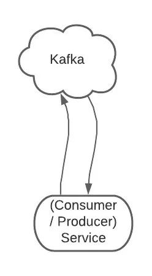

# Topics 主题

Topic 是生产者发送消息的目标地址，是消费者的监听目标。

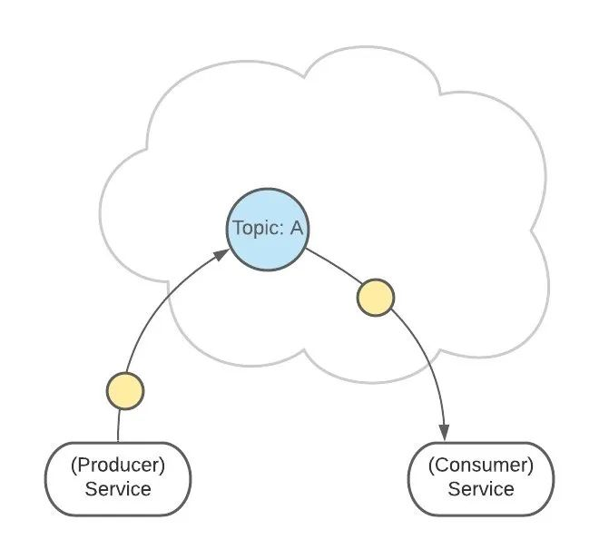

一个服务可以监听、发送多个 Topics。

Kafka 中有一个【consumer-group（消费者组）】的概念。

这是一组服务，扮演一个消费者。

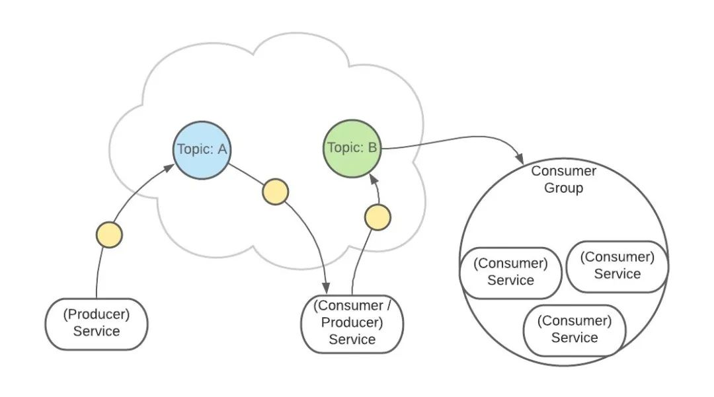

如果是消费者组接收消息，Kafka 会把一条消息路由到组中的某一个服务。

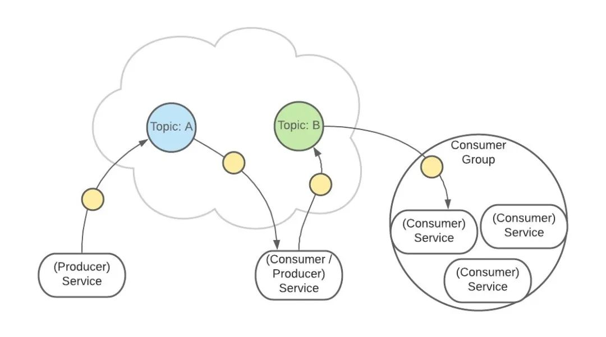

这样有助于消息的负载均衡，也方便扩展消费者。

Topic 扮演一个消息的队列。

首先，一条消息发送了。

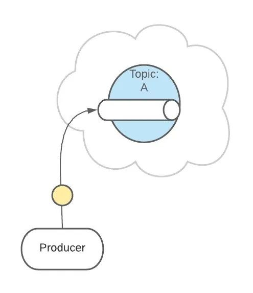

然后，这条消息被记录和存储在这个队列中，不允许被修改。

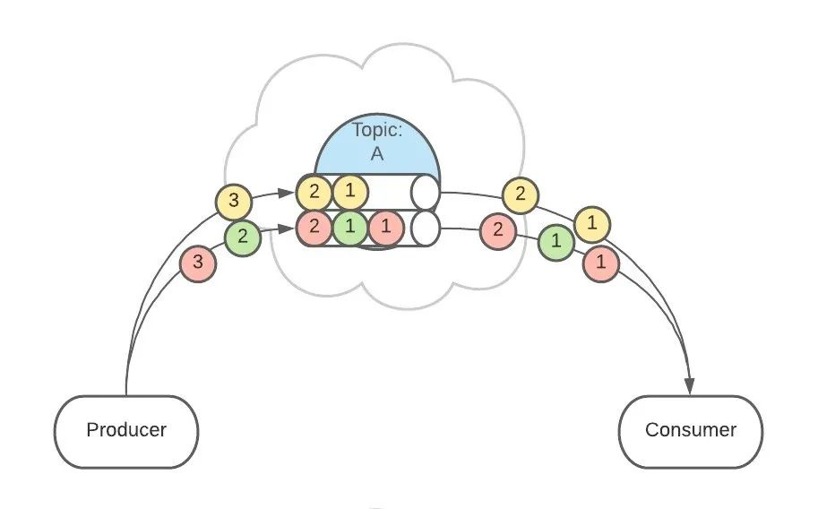

接下来，消息会被发送给此 Topic 的消费者。

但是，这条消息并不会被删除，会继续保留在队列中。

继续发送消息。

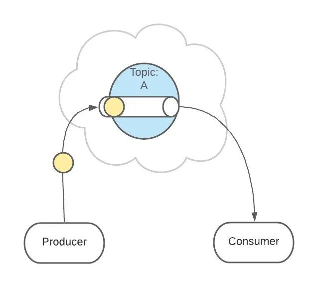

像之前一样，这条消息会发送给消费者、不允许被改动、一直呆在队列中。

（消息在队列中能呆多久，可以修改 Kafka 的配置）

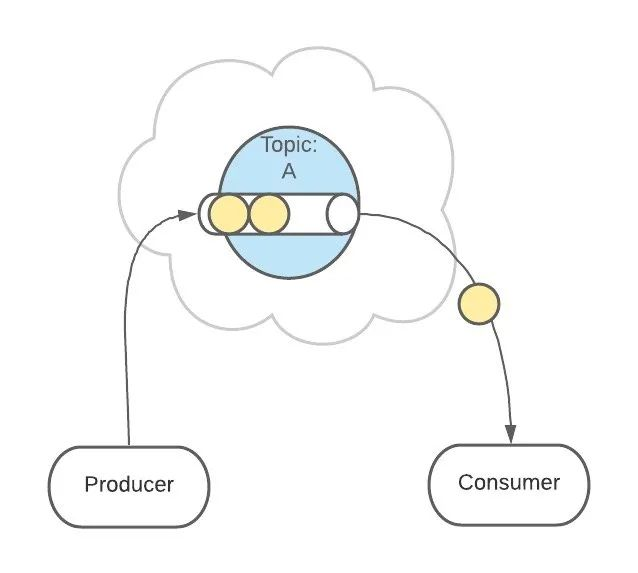

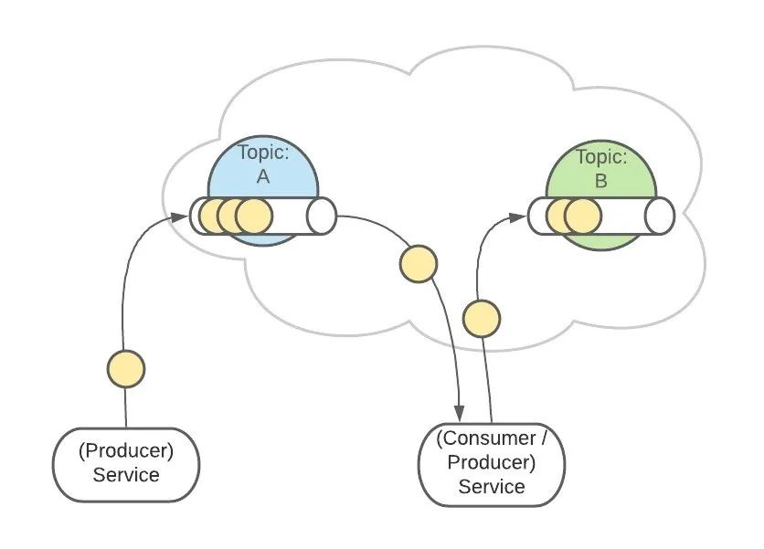

# Partitions 分区

上面 Topic 的描述中，把 Topic 看做了一个队列，实际上，一个 Topic 是由多个队列组成的，被称为【Partition（分区）】。

这样可以便于 Topic 的扩展。

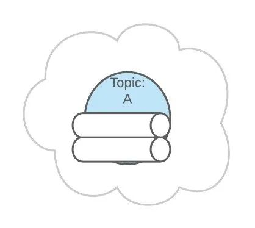

生产者发送消息的时候，这条消息会被路由到此 Topic 中的某一个 Partition。

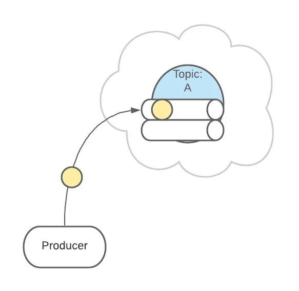

消费者监听的是所有分区。

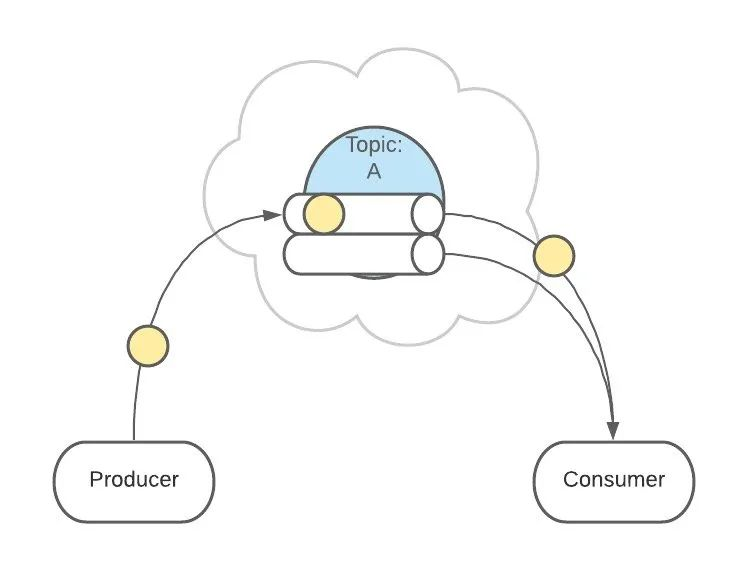

生产者发送消息时，默认是面向 Topic 的，由 Topic 决定放在哪个 Partition，默认使用轮询策略。

也可以配置 Topic，让同类型的消息都在同一个 Partition。

例如，处理用户消息，可以让某一个用户所有消息都在一个 Partition。

例如，用户1发送了3条消息：A、B、C，默认情况下，这3条消息是在不同的 Partition 中（如 P1、P2、P3）。

在配置之后，可以确保用户1的所有消息都发到同一个分区中（如 P1）。

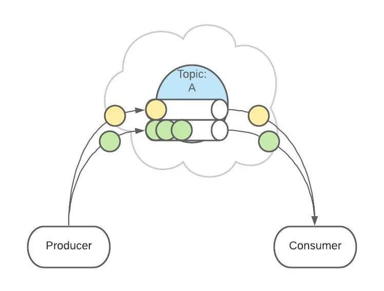

这个功能有什么用呢？

这是为了提供消息的【有序性】。

消息在不同的 Partition 是不能保证有序的，只有一个 Partition 内的消息是有序的。

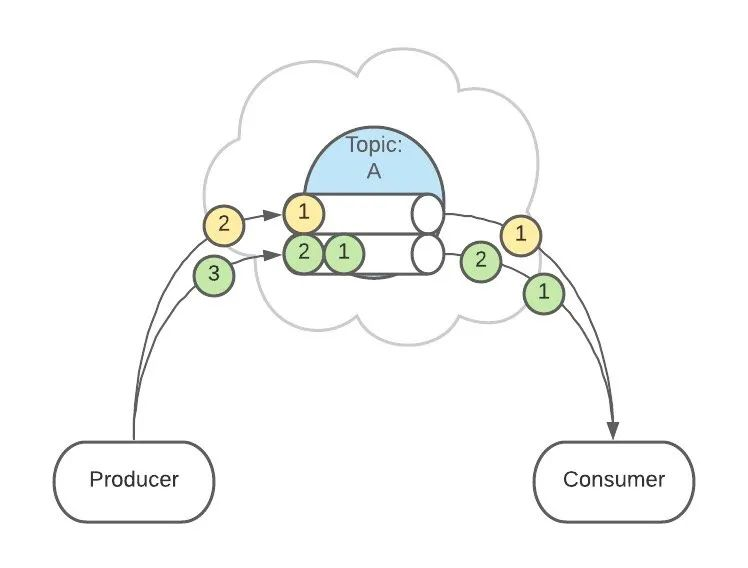

# 架构

Kafka 是集群架构的，ZooKeeper是重要组件。

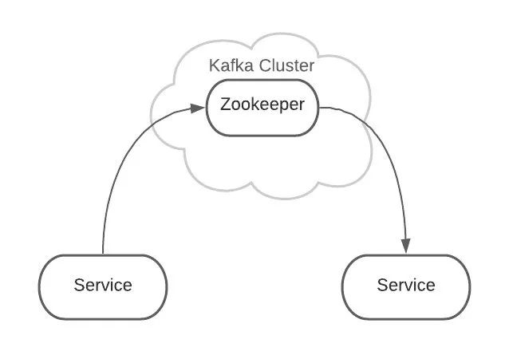

ZooKeeper 管理者所有的 Topic 和 Partition。

Topic 和 Partition 存储在 Node 物理节点中，ZooKeeper负责维护这些 Node。

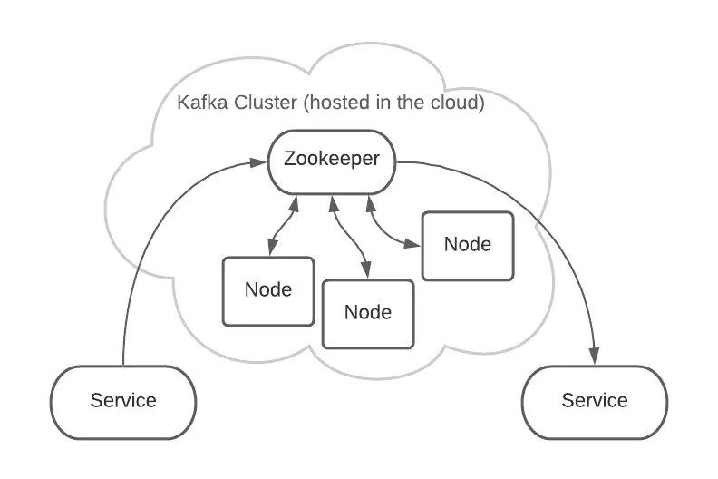

例如，有2个 Topic，各自有2个 Partition。

这是逻辑上的形式，但在 Kafka 集群中的实际存储可能是这样的：

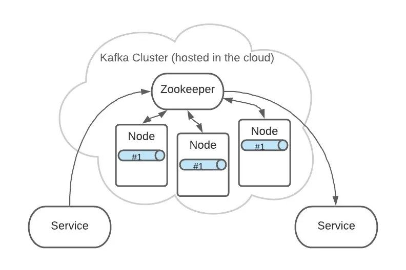

Topic A 的 Partition #1 有3份，分布在各个 Node 上。

这样可以增加 Kafka 的可靠性和系统弹性。

3个 Partition #1 中，ZooKeeper 会指定一个 Leader，负责接收生产者发来的消息。

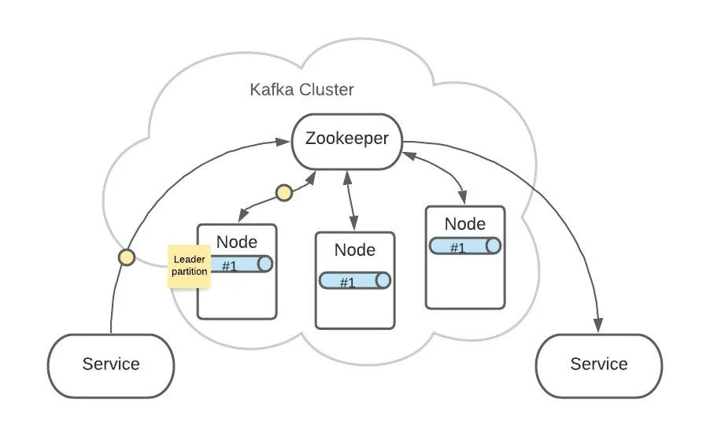

其他2个 Partition #1 会作为 Follower，Leader 接收到的消息会复制给 Follower。

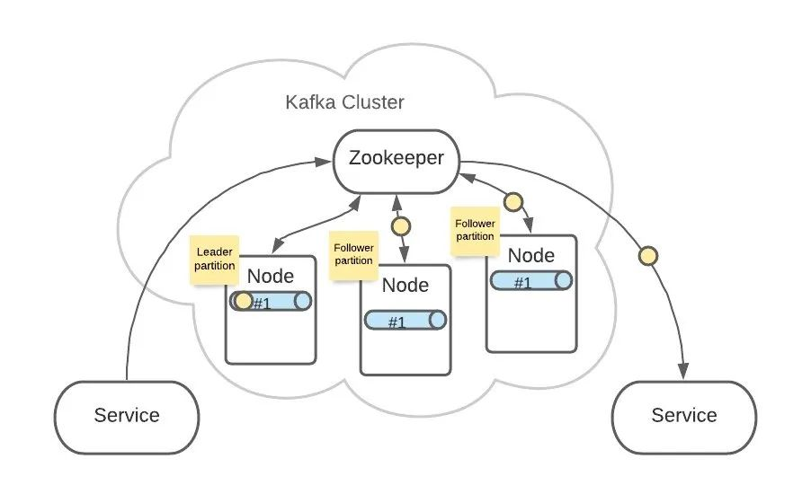

这样，每个 Partition 都含有了全量消息数据。

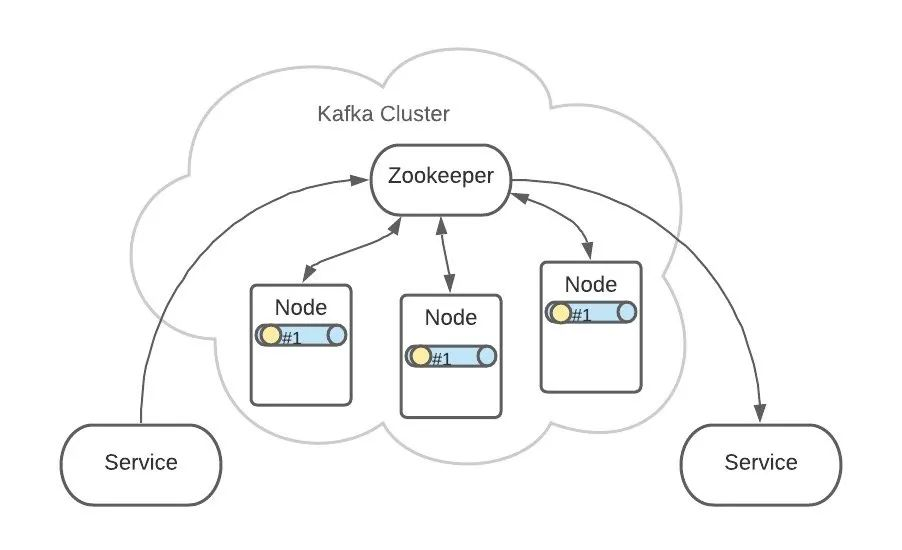

即使某个 Node 节点出现了故障，也不用担心消息的损坏。

Topic A 和 Topic B 的所有 Partition 分布可能就是这样的：

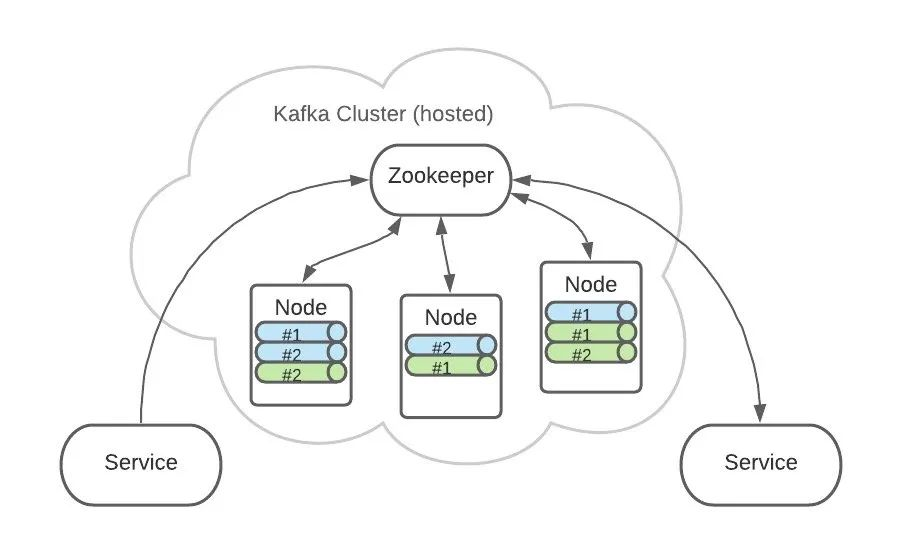

翻译整理自：

https://timothystepro.medium.com/visualizing-kafka-20bc384803e7

--- EOF ---