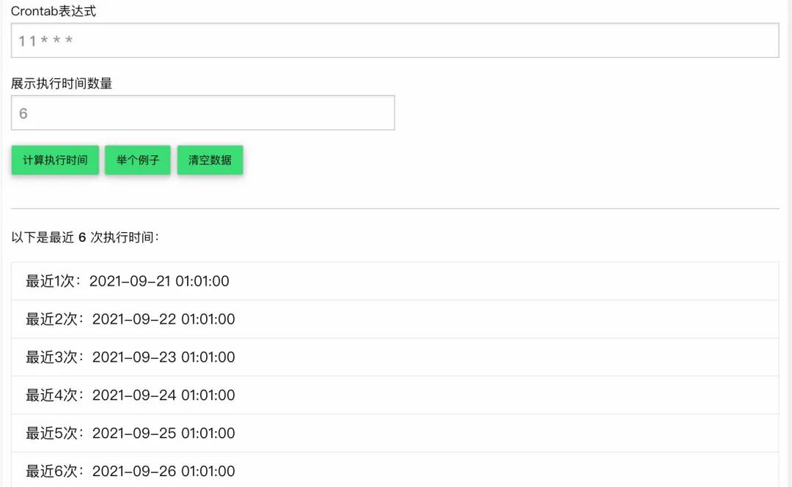

# 定时启动运行的crontab命令

> 每 5、10 或 15 分钟执行一次任务,我们使用crontab命令。

> crontab通常用于自动化系统维护或管理，例如备份数据库或补丁更新系统、检查磁盘空间使用情况 、发送电子邮件等。

### Crontab 语法和运算符

> crontab 是一个文本文件，它定义了 cron 任务的时间表。可以 使用该命令创建、查看、修改和删除Crontab 文件`crontab`。

> 用户 crontab 文件中的每一行包含六个字段，由一个空格分隔，后跟要运行的命令：

```
* * * * * command(s)
^ ^ ^ ^ ^
| | | | |     allowed values
| | | | |     -------
| | | | ----- Day of week (0 - 7) (Sunday=0 or 7)
| | | ------- Month (1 - 12)
| | --------- Day of month (1 - 31)
| ----------- Hour (0 - 23)
------------- Minute (0 - 59)
```

> 前五个字段（时间和日期）可以接受以下运算符：

- `*` 星号运算符表示所有允许的值。如果 Minute 字段中有星号符号，则表示该任务将每分钟执行一次。
- `-` 连字符运算符允许你指定值的范围。如果你`1-5`在星期几字段中设置，则任务将在每个工作日（从星期一到星期五）运行。范围是包含的，这意味着范围内包括第一个和最后一个值。
- `,` 逗号运算符允许你定义重复值列表。例如，如果你`1,3,5`在小时字段中有，则任务将在凌晨 1 点、凌晨 3 点和凌晨 5 点运行。该列表可以包含单个值和范围，`1-5,7,8,10-15`
- `/` 斜线运算符允许你指定可与范围结合使用的步长值。例如如果你`1-10/2`在 Minutes 字段中设置，则表示将在 1-10 范围内每两分钟执行一次操作，与指定`1,3,5,7,9`. 除了一系列值，你还可以使用星号运算符。要指定每 20 分钟运行一次任务，你可以使用*/20。

> 系统范围的 crontab 文件的语法与用户 crontab 略有不同。它包含一个额外的必填用户字段，用于指定哪个用户将运行 cron 任务。

```
* * * * * <username> command(s)
```

> 要编辑 crontab 文件，或者如果它不存在则创建一个，请使用该`crontab -e`命令。

### 每 5 分钟调用一次接口

> 有两种方法可以每五分钟运行一次 cron 任务。

> 第一个选项是使用逗号运算符创建分钟列表：

```
0,5,10,15,20,25,30,35,40,45,50,55  * * * * /usr/bin/curl https://json.im/91bb49ade5df.json
```

> 上面语法上没问题,但是不够精简。下面的写法更精简,更不容易出错。

```
*/5  * * * * /usr/bin/curl https://json.im/91bb49ade5df.json
```

> `*/5` 表示创建一个包含所有分钟的列表，并从列表中每5个值运行一次任务。

### 每 10 分钟调用一次接口

> 要每 10 分钟运行一次 cron 任务，请在你的 crontab 文件中添加以下行：

```
*/10  * * * * /usr/bin/curl https://json.im/91bb49ade5df.json
```

### 每 15 分钟调用一次接口

> 要每 15 分钟运行一次 cron 任务，请在你的 crontab 文件中添加以下行：

```
*/15  * * * * /usr/bin/curl https://json.im/91bb49ade5df.json
```


# 常用crontab表达式

### crontab 语法介绍

```
*    *    *    *    *
-    -    -    -    -
|    |    |    |    |
|    |    |    |    +----- 星期中星期几 (0 - 6) (星期天 为0)
|    |    |    +---------- 月份 (1 - 12) 
|    |    +--------------- 一个月中的第几天 (1 - 31)
|    +-------------------- 小时 (0 - 23)
+------------------------- 分钟 (0 - 59)
```

### 模拟运行工具

> `https://tooltt.com/crontab/` 可以查看最近几次运行的时间, 方便调试。点击原文就可以访问。




### 常用表达式

| 描述                                            | 表达式              |
| ----------------------------------------------- | ------------------- |
| 每1分钟执行一次                                 | `* * * * *`         |
| 每小时的第3和第15分钟执行                       | `3,15 * * * *`      |
| 在上午8点到11点的第3和第15分钟执行              | `3,15 8-11 * * *`   |
| 每隔两天的上午8点到11点的第3和第15分钟执行      | `3,15 8-11 */2 * *` |
| 每个星期一的上午8点到11点的第3和第15分钟执行    | `3,15 8-11 * * 1`   |
| 每晚的21:30执行                                 | `30 21 * * *`       |
| 每月1,10,22日的4:45执行                         | `45 4 1,10,22 * *`  |
| 每周六,周日的1:10执行                           | `10 1 * * 6,0`      |
| 每天18:00至23:00之间每隔30分钟执行              | `0,30 18-23 * * *`  |
| 每星期六的晚上11:00pm执行                       | `0 23 * * 6`        |
| 每一小时执行                                    | `* */1 * * *`       |
| 晚上11点到早上7点之间,每隔一小时执行            | `* 23-7/1 * * *`    |
| 每月的4号与每周一到周三的11点执行               | `0 11 4 * mon-wed`  |
| 一月一号的4点执行                               | `0 4 1 jan *`       |
| 指定每小时的第5分钟执行一次                     | `5 * * * *`         |
| 指定每天的5:30执行                              | `30 5 * * *`        |
| 指定每月8号的7:30分执行                         | `30 7 8 * *`        |
| 指定每年的6月8日5:30执行                        | `30 5 8 6 *`        |
| 指定每星期日的6:30执行                          | `30 6 * * 0`        |
| 每月10号及20号的3:30执行                        | `30 3 10,20 * *`    |
| 每天8-11点的第25分钟执行                        | `25 8-11 * * *`     |
| 每15分钟执行一次                                | `*/15 * * * *`      |
| 每个月中,每隔10天6:30执行一次                   | `30 6 */10 * *`     |
| 每天早上8点30分执行                             | `30 08 * * *`       |
| 每周日下午6点30分执行                           | `30 18 * * 0`       |
| 每周日下午6点30分执行                           | `30 18 * * Sun`     |
| 每年6月10日早上8点30分执行                      | `30 08 10 06 *`     |
| 每月1日,15日,29日晚上9点30分各执行一次          | `30 21 1,15,29 * *` |
| 每隔10分钟执行一次                              | `*/10 * * * *`      |
| 从早上9点到下午6点,凡遇到整点就执行             | `00 09-18 * * *`    |
| 每隔5秒执行一次                                 | `*/5 * * * *`       |
| 每隔1分钟执行一次                               | `0 */1 * * *`       |
| 每天23点执行一次                                | `0 23 * * *`        |
| 每天凌晨1点执行一次                             | `0 1 * * *`         |
| 每月1号凌晨1点执行一次                          | `0 1 1 * *`         |
| 在26分,29分,33分执行一次                        | `0 26,29,33 * * *`  |
| 每隔两天的上午8点到11点的第3和第15分钟执行      | `3,15 8-11 */2 * *` |
| 每周一上午8点到11点的第3和第15分钟执行          | `3,15 8-11 * * 1`   |
| 每晚的21:30执行                                 | `30 21 * * *`       |
| 每月1,10,22日的4:45执行                         | `45 4 1,10,22 * *`  |
| 每一小时执行                                    | `* */1 * * *`       |
| 晚上11点到早上7点之间,每隔一小时执行            | `0 23-7 * * *`      |
| 每隔1分钟执行一次                               | `0 */1 * * *`       |
| 每天22点执行一次                                | `0 22 * * *`        |
| 在24分,30分执行一次                             | `0 24,30 * * *`     |
| 每天早上6点                                     | `0 6 * * *`         |
| 每两个小时                                      | `0 */2 * * *`       |
| 晚上11点到早上8点之间每两个小时和早上八点       | `0 23-7/2,8 * * *`  |
| 每个月的4号和每个礼拜的礼拜一到礼拜三的早上11点 | `0 11 4 * 1-3`      |
| 1月1日早上4点                                   | `0 4 1 1 *`         |
| 每小时[第一分钟]执行                            | `01 * * * *`        |
| 每天[凌晨4:02]执行                              | `02 4 * * *`        |
| 每星期[周日凌晨4:22]执行                        | `22 4 * * 0`        |
| 每月[1号凌晨4:42]去执行                         | `42 4 1 * *`        |
| 每周一,三,五的下午3:00执行                      | `00 15 * * 1,3,5`   |
| 每小时的10分,40分执行                           | `10,40 * * * *`     |
| 每小时的1分执行                                 | `1 * * * *`         |
| 每天早晨三点二十分执行                          | `20 3 * * *`        |
| 每五分钟执行                                    | `*/5 * * * *`       |
| 每小时执行                                      | `0 * * * *`         |
| 每天执行                                        | `0 0 * * *`         |
| 每周执行                                        | `0 0 * * 0`         |
| 每月执行                                        | `0 0 1 * *`         |
| 每年执行                                        | `0 0 1 1 *`         |
| 在每小时的46分钟后每6小时运行一次               | `46 */6 * * *`      |
| 在凌晨2:10运行                                  | `10 2 * * *`        |
| 在凌晨3:15运行                                  | `15 3 * * *`        |
| 凌晨4:20运行                                    | `20 4 * * *`        |
| 凌晨5:31运行                                    | `31 5 * * *`        |
| 在下午5:31运行                                  | `31 17 * * *`       |
| 每分钟执行                                      | `* * * * *`         |
| 每2分钟执行                                     | `*/2 * * * *`       |
| 每小时的2分执行                                 | `2 * * * *`         |
| 每半小时执行                                    | `*/30 * * * *`      |
| 分钟是50分的倍数时执行                          | `*/50 * * * *`      |
| 每天整点执行                                    | `0 * * * *`         |
| 每小时的15分执行                                | `15 * * * *`        |
| 每天12点5分 执行                                | `5 12 * * *`        |
| 每天10点到18点整点执行                          | `0 10-18 * * *`     |
| 每天10点和18点半点执行                          | `30 10,18 * * *`    |
| 从0点开始，每隔4小时半点执行                    | `30 */4 * * *`      |
| 从1点开始，每隔4小时半点执行                    | `30 1-23/4 * * *`   |
| 每周六中午12点执行                              | `0 12 * * 6`        |
| 每周六中午12点执行                              | `0 12 * * sat`      |
| 每周二,四,六中午12点执行                        | `0 12 * * 2-6/2`    |
| 周末中午12点执行                                | `0 12 * * sat,sun`  |
| 每周日的凌晨0点执行                             | `0 0 * * 0`         |
| 每周一,二的8点和12点执行                        | `0 8,12 * * 1,2`    |
| 每月1日的凌晨0点执行                            | `0 0 1 * *`         |
| 每月25日的17点执行                              | `0 17 25 * *`       |
| 每单数月份的25日的17点执行                      | `0 17 25 */2 *`     |
| 每小时的第5和第15分钟执行                       | `5,15 * * * *`      |
| 在上午9点到11点的第5和第15分钟执行              | `5,15 9-11 * * *`   |
| 每隔3天的上午9点到11点的第5和第15分钟执行       | `5,15 9-11 */3 * *` |
| 每个星期一的上午9点到11点的第5和第15分钟执行    | `5,15 9-11 * * 1`   |
| 每月1,11,21日的14:45重启httpd                   | `45 14 1,11,21 * *` |
| 每周六,周日的1:10执行                           | `10 1 * * 6,0`      |
| 每小时执行                                      | `01 * * * *`        |
| 每隔1分钟执行一次                               | `*/1 * * * *`       |
| 每隔10分钟执行一次                              | `*/10 * * * *`      |
| 每1小时执行一次                                 | `0 */1 * * *`       |
| 每2小时执行一次                                 | `0 */2 * * *`       |
| 每天10点执行                                    | `0 10 * * *`        |
| 每天19点30分执行                                | `30 19 * * *`       |
| 每周一10点执行                                  | `0 10 * * 1`        |
| 每周五17点30分执行                              | `30 17 * * 5`       |
| 每年的10月1日10点执行                           | `0 10 1 10 *`       |
| 每年的8月8日20点执行                            | `0 20 8 8 *`        |
| 指定每小时的第5分钟执行一次命令                 | `5 * * * *`         |
| 指定每天的5:30执行命令                          | `30 5 * * *`        |
| 指定每月8号的7:30分执行命令                     | `30 7 8 * *`        |
| 指定每年的6月8日5:30执行命令                    | `30 5 8 6 *`        |
| 指定每星期日的6:30执行命令                      | `30 6 * * 0`        |
| 每月10号及20号的3：30执行命令                   | `30 3 10,20 * *`    |
| 每天8-11点的第25分钟执行命令                    | `25 8-11 * * *`     |
| 每15分钟执行一次命令                            | `*/15 * * * *`      |
| 每个月中,每隔10天6:30执行一次命令               | `30 6 */10 * *`     |
| 每天 02:00 执行任务                             | `0 2 * * *`         |
| 每天5:00和17:00执行任务                         | `0 5,17 * * *`      |
| 每周日 17:00 执行任务                           | `0 17 * * sun`      |
| 每10min 执行一次任务                            | `*/10 * * * *`      |
| 在每周五,周日的17点执行任务                     | `0 17 * * sun,fri`  |
| 每四个小时执行一个任务                          | `0 */4 * * *`       |