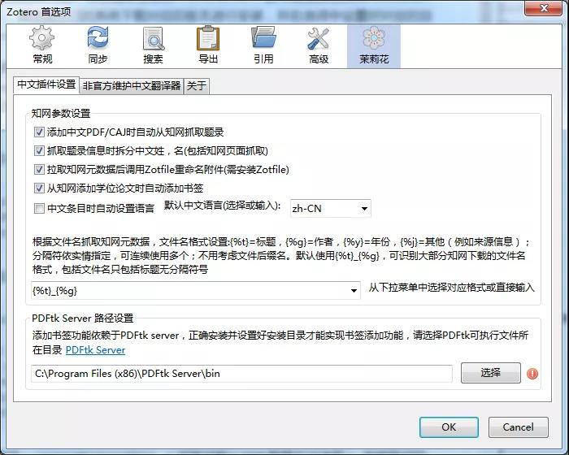
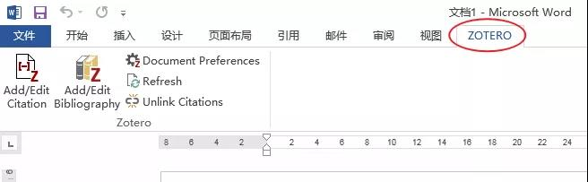
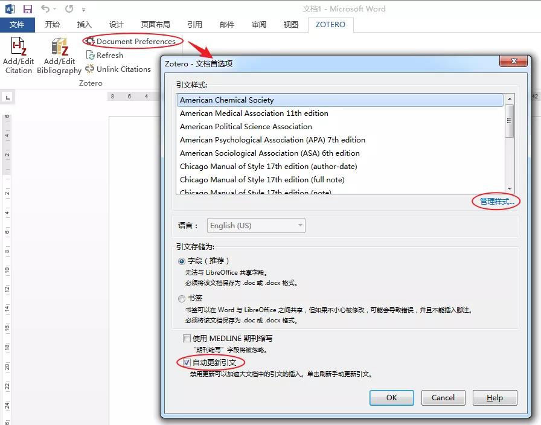
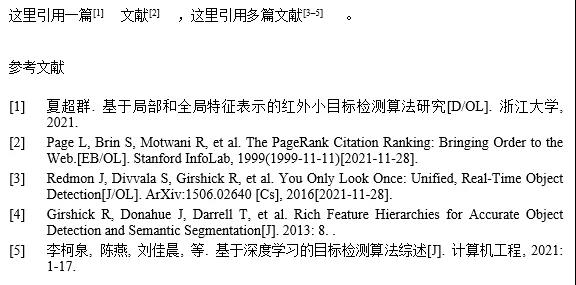

# Zotero——一款免费好用的文献管理软件

本文内容包括以下几个方面：

1. 为什么选择Zotero？
2. 如何安装Zotero？
3. 如何导入文献？
4. 如何管理文献？
5. 如何引用文献？
6. 如何修改参考文献样式？
7. 其它

 

**1. 为什么选择Zotero？**

文献管理的软件有很多，常见的包括EndNote、Citavi、NoteExpress、Mendeley等。

其中EndNote无疑是行业老大，其功能强大，应用广泛，很多学校都购买了版权。

Citavi据说功能也很强大，它已经不是一款单纯的文献管理软件，而是“文献管理与知识组织”工具，在德语国家应用较多。

NoteExpress是国产软件，对中文支持比较好。

Mendeley是免费软件，支持内嵌的PDF阅读、批注和全文搜索。

关于这几款软件的详细比较，可以参考：

https://zhuanlan.zhihu.com/p/83348460

在此之前，我使用过EndNote，说实话真心不好用（也许是我用得太少），至少在我所看重的功能上不够易用。也试用过Mendeley，感觉文献同步速度有点慢。

个人觉得，对于大多数并**不长期从事学术研究**的人来说，在文献管理方面的**核心需求**主要包括以下几点：

1. 能够方便地从文献数据库导入文献
2. 能够对文献进行分门别类的管理（相对也不重要）
3. 能够在引用文献时自动编号并生成规范的参考文献列表
4. 能够自定义参考文献样式

而这些功能，Zotero都做到了，并且**很容易上手**，同时它还是一款**开源免费**软件，有很多插件可以使用，支持Windows、Mac、Linux**三大平台**。

以上便是个人选择并推荐Zotero的理由。

**2. 如何安装Zotero？**

本小节介绍Zotero以及其常用插件的安装方法。

**▍安装Zotero**

Zotero的官方网站为：https://www.zotero.org/

单击Download按钮，进入下载页面，网页会自动根据你的系统和浏览器显示相应的软件版本。

下载完程序后，运行安装向导，一路默认安装即可。

安装结束后运行Zotero，其界面如下图所示：

**安装Zotero Connector**

Zotero Connector是为了方便从文献数据库网站导入文献，而提供的浏览器插件。

安装好Zetero Connector后，当我们浏览文献网站时，它会自动分析网页中的文献信息，我们只需点击一下图标就能将文献保存到Zetero本地文库中。   

**安装茉莉花插件**

“茉莉花”是网友linxingzhong针对中文文献而开发的一款插件，可以方便地从知网抓取数据。如果你用不到国内的文献，可以跳过这一步。

“茉莉花”插件的GitHub地址为:

https://github.com/l0o0/jasminum

在Releases页面找到最新版（目前是0.1.2），下载其中的.xpi文件。

下载完后，打开Zotero程序，依次点击菜单【工具】【插件】，点击插件管理器【右上角的齿轮图标】，执行【Install Add-on From File...】，选择刚下载的.xpi文件。 

安装完后，我们可以从Zotero的【编辑】【首选项】菜单中看到插件的相关配置。 

如果想使对PDF添加书签，需要安装PDFtk server，这里不详细介绍。

此外，Zotero的官网还提供了一份插件列表，你可以在此寻找更多工具，比如方便附件管理的ZotFile，用于LaTeX/Markdown参考文献的Better BibTeX等。

插件列表地址：

https://www.zotero.org/support/plugins

**3. 如何导入文献？**

本小节介绍几种常用的文献导入方法。

**▍从网页导入单篇文献**

使用Zotero导入文献非常方便，当我们浏览文献网站时，Zotero Connector会自动识别当前网页的文献元数据，并根据文献类型显示为不同的图标，我们只需点击图标就能自动将文献信息及其PDF文件添加到Zotero文库中。

如下图，我们访问谷歌的PageRank论文页面，点击图标即可一键导入文献。

打开软件，可以看到刚才导入成功的文献信息以及自动下载的PDF文件。 

**从网页导入多篇文献**

如果是通过谷歌学术这样的网站搜索出多篇文献，当我们点击按钮后，会弹出一个选择列表，可选择多篇文献同时导入，非常便捷。

**通过PDF导入文献**

对于已经下载好的PDF文献，我们可以将其直接拖入Zotero界面中，程序会自动识别PDF中的元数据，并为之创建文献信息。

**知网文献的导入**

安装了“茉莉花”插件后，知网的文献导入也跟上面一样便捷。

对于知网中不提供PDF下载的文献，我们可以先在网页中添加文献信息，然后再把下载的CAJ文件拖到对应的文献信息下面。当然，更简单的方法是直接下载CAJ文件，将其拖到Zotero界面中，让其自动抓取文献信息并生成文献条目。

**通过引用文件导入**

Zotero支持直接通过BibTeX、EndNote等引用文件导入，方法是依次点击菜单【文件】【导入...】，选择下载好的引用文件即可。

对于像BibTeX、EndNote这样标准的引用格式，我们也可以复制好引文后，直接通过剪贴板导入，方法是点击菜单【文件】【从剪贴板导入】。   

**▍手动添加文献**

我们也可以采用完全手工的方法添加文献条目，选择条目类型后，手动输入相应的文献信息，如标题、作者、摘要等。

**4. 如何管理文献？**

本小节介绍Zotero的界面及其基本使用方法。

**▍界面介绍**

Zotero的界面分为三栏，左侧为文库分类目录，中间为当前分类下的文献列表，右侧为当前文献的信息。

界面左下方为当前分类下所有文献的标签列表，单击标签可快速过滤出带有相应标签的文献条目，再次点击标签则取消。

界面右上方的输入框可以输入要检索的文字，如标题、作者、期刊、标签等任意元数据信息，以查找相应的文献条目。

**▍创建分类**

分类如同操作系统中的目录，Zotero支持多级分类目录，我们可以通过左上角的【新建分类】按钮在【我的文库】下创建分类。创建好分类后，再将文献条目拖动到对应的分类中，以达到分门别类管理的目的。

此外，当创建好分类后，我们也可以在导入文献时直接选择文献要存储的分类目录。

**▍添加标签**

标签可用于文献的查找和过滤，Zotero默认会将文献的关键字创建为标签，我们也可以选择手动添加标签，方法是在【标签】页中点击【Add】。

**添加笔记**

我们还可以为文献添加多条笔记，方法是在【笔记】页中点击【添加】按钮，输入笔记内容即可。

**合并与拆分作者姓名**

Zotero默认是将作者的姓与名分开的，如果需要将姓名合在一起，可以通过“茉莉花”插件提供的小工具一键切换。

**5. 如何引用文献？**

本小节介绍如何在Word中引用文献并生成参考文献目录。

**▍安装Word插件**

Zotero在安装的时候会自动为Word安装插件（加载项），当我们打开Word的时候，会看到一个ZOTERO标签页。

 

如果没有，可以在Zotero中依次点击【编辑】【首选项】【引用】【文字处理软件】【重新安装加载项Microsoft Word】修复。 

**▍选择和添加样式**

不同的期刊、不同的学校对参考文献的格式有不同的规定，我们在添加文献引用前，需要先选择好样式（之后也可以随时更改）。

在Word中点击【Document Preferences】（注意：需要先打开Zotero），弹出的窗口显示了已经安装的样式列表，选择好样式后，点击【OK】。

可以取消【自动更新引文】的勾选，以免影响Word编辑速度，但之后要更新引文的话，需要手动点击工具栏里的【Refresh】按钮。

如果我们所需的样式不在默认的列表中，可以点击【管理样式...】【获取更多样式...】。Zotero当前提供了10000多种样式供选择，我们可以在【Style Search】中输入关键字进行查找。这里，我们输入GB/T，选择最新的国标GB/T 7714-2015(numeric)，numeric表示引文为数字编号。

**▍添加文献引用**

使用Zotero添加文献引用非常简单，只需把光标移到要插入引用的地方，然后点击工具栏中的【Add/Edit Citation】按钮，输入论文标题或者作者姓名关键字，从查找结果中选择所需论文，回车即可。

注意：如果输入的是中文关键字，可能需要敲击一下空格才会触发查找。

如果是引用多篇文献，只需在选择好一篇文献后，敲击空格，然后再依次输入其它文献的关键字，最后回车确定。   

在确定之前，可以点击文献条目，在弹出的框中输入页码等信息。 

如果不记得文献关键字，也可以单击输入框左侧的图标，选择【经典视图】，在弹出的窗口中直接选择所需的文献。   

**▍添加参考文献目录**

Zotero允许我们在指定位置插入参考文献目录，方法是先将光标移到我们想要的位置，然后点击工具栏中的【Add/Edit Bibiography】按钮即可。

注意：如果遇到文献插入多了后Word变得很卡的情况，可以在Word选项中关闭【键入时检查拼写】和【键入时标记语法错误】选项。

**6. 如何修改参考文献样式？**

本小节介绍如何添加第三方样式、自定义样式以及对参考文献格式进行修改。

**▍添加第三方样式**

如果官方提供的样式不能满足需求，我们还可以导入第三方提供的样式。

Zotero的样式采用的是开放的CSL（Citation Style Language）格式，包括Mendeley在内的不少文献管理工具都采用了此格式，这就意味着网络上有大量的共享资源可以使用。

比如下面这个GitHub页面就提供了基于GB/T 7714的多个修改版：

https://github.com/redleafnew/Chinese-std-GB-T-7714-related-csl

这里作为演示，我们选择其中的gb-t-7714-2015-numeric-aulower-bilan.csl，在页面中点击【Raw】按钮，Zotero Connector会自动识别并弹出安装提示，点击【OK】。

忽略下面的警告，点击【OK】，便可将样式安装到Zotero中。 

也可以将CSL文件下载到电脑，然后在【Zotero首选项】的【引用】页面中，点击【+】，选择CSL文件进行安装。 

安装好样式后，回到Word，点击【Document Preferences】可切换样式。 

**自定义样式**

前面已经提到，Zotero的样式采用的是CSL（Citation Style Language）语言，这是一种基于XML的描述性文本语言，比较直观易学。

CSL的官方网站为：

https://citationstyles.org

其规范可以在以下页面查看：

https://docs.citationstyles.org/en/1.0.1/specification.html

在Zotero中，我们可以通过【首选项】中的【样式编辑器】修改或创建样式。

在样式编辑器中，可以查看样式的CSL代码，并预览其效果。在修改好样式后，可以【另存为】新的样式文件，注意要修改title、title-short和id。 

也可以通过下面的网页进行CSL样式的查找和编辑：

https://editor.citationstyles.org/about

**修改参考文献格式**

即便有了正确的样式文件，最后输出的参考文献内容和格式也不一定满足我们的要求，所以还得进行一些调整。

如下图就是前面的例子采用gb-t-7714-2015-numeric-aulower-bilan.csl样式的输出结果。可以看到，有两篇英文文献的作者显示的是“等”（正确应该为et al），还有两篇文献的日期不对。此外，参考文献的字体大小、行距、悬挂缩进等也不一定满足要求。

首先，对文献的内容进行调整，内容存在问题主要是因为文献的**元数据不对**。

gb-t-7714-2015-numeric-aulower-bilan.csl样式是根据文献的语言决定把三人以上的作者显示为“等”还是“et al”，所以我们需要将英文文献的【语言】设置为“en”。

 

将日期字段设置正确。 

修改好后，回到Word，点击ZOTERO工具栏里的【Refresh】按钮，可以看到参考文献的内容已经改变。 

然后修改参考文献的格式。比较好的方法是直接修改Word里面【**书目**】样式，将悬挂缩进、段落间距、行距等设到所需的值。 

为了让参考文献编号后的文字能与悬挂缩进对齐，需要将CSL样式里citation_number的suffix中的空格改为Tab，在代码中写为“&#9;”，然后另存样式后重新安装。 

最后在Word中点击ZOTERO工具栏中的【Refresh】按钮，修改后的参考文献样式如下。 

**7. 其它**

除了上述基本功能外，Zotero还提供了同步功能和免费的300MB存储空间，可在不同计算机之间同步文库。

Zotero的数据存储位置可以在【高级】【文件和文件夹】中查看，如果不用Zotero的云存储，也可以选择手动拷贝此文件夹中的所有文件进行同步。   

此外，网上也有使用第三方网盘进行同步的配置教程，本文就不做介绍了。

更多内容可参考以下链接。

Zotero的官方文档：

https://www.zotero.org/support

网友johnmy的经验总结：

https://www.zhihu.com/column/c_1071081428967743488

