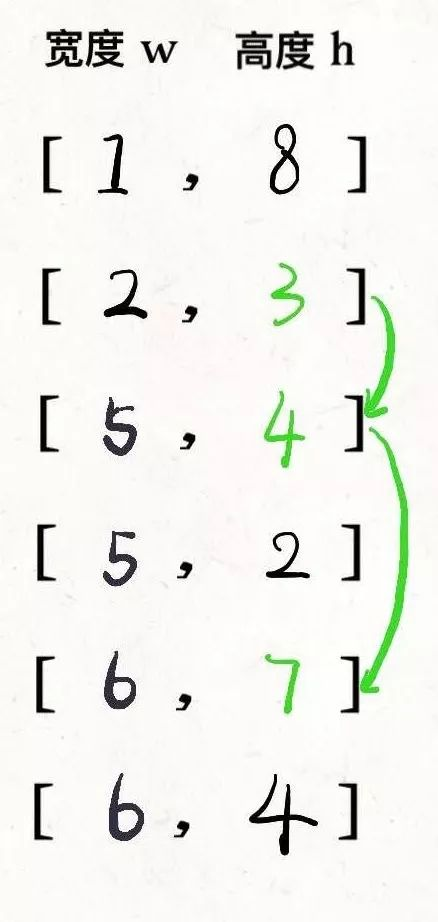
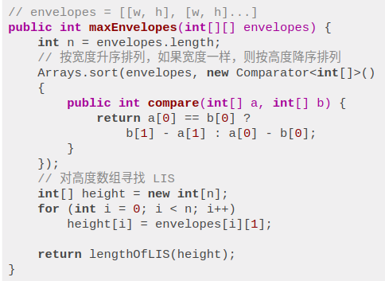

# 最长递增子序列之信封嵌套问题

很多算法问题都需要排序技巧，其难点不在于排序本身，而是需要巧妙地排序进行预处理，将算法问题进行转换，为之后的操作打下基础。

信封嵌套问题就需要先按特定的规则排序，之后就转换为一个最长递增子序列问题，可以用前文 [动态规划设计之最长递增子序列](http://mp.weixin.qq.com/s?__biz=MzU0MDg5OTYyOQ==&mid=2247484232&idx=1&sn=21234a9e4db908f438e1cb2e8c7ffff4&chksm=fb33630acc44ea1c91027bff20e9902e20e4269d54f3c178dc1e07f344d48d7ff1a4ca48ba39&scene=21#wechat_redirect) 的技巧来解决了。

### 一、题目概述

信封嵌套问题是个很有意思且经常出现在生活中的问题，先看下题目：

这道题目其实是最长递增子序列（Longes Increasing Subsequence，简写为 LIS）的一个变种，因为很显然，每次合法的嵌套是大的套小的，相当于找一个最长递增的子序列，其长度就是最多能嵌套的信封个数。

但是难点在于，标准的 LIS 算法只能在数组中寻找最长子序列，而我们的信封是由`(w,h)`这样的二维数对形式表示的，如何把 LIS 算法运用过来呢？

读者也许会想，通过`w×h`计算面积，然后对面积进行标准的 LIS 算法。但是稍加思考就会发现这样不行，比如`1×10`大于`3×3`，但是显然这样的两个信封是无法互相嵌套的。

### 二、解法

这道题的解法是比较巧妙的：

**先对宽度w进行升序排序，如果遇到w相同的情况，则按照高度h降序排序。之后把所有的h作为一个数组，在这个数组上计算 LIS 的长度就是答案。**

画个图理解一下，先对这些数对进行排序：

然后在`h`上寻找最长递增子序列：

这个子序列 [2,3],[5,4],[6,7] 就是最优的嵌套方案。

这个解法的关键在于，对于宽度`w`相同的数对，要对其高度`h`进行降序排序。因为两个宽度相同的信封不能相互包含的，而逆序排序保证在`w`相同的数对中最多只选取一个计入 LIS。

下面看代码：

关于最长递增子序列的寻找方法，在前文 [动态规划设计之最长递增子序列](http://mp.weixin.qq.com/s?__biz=MzU0MDg5OTYyOQ==&mid=2247484232&idx=1&sn=21234a9e4db908f438e1cb2e8c7ffff4&chksm=fb33630acc44ea1c91027bff20e9902e20e4269d54f3c178dc1e07f344d48d7ff1a4ca48ba39&scene=21#wechat_redirect) 中详细介绍了动态规划解法,并用扑克牌游戏解释了二分查找解法，本文就不展开了，直接套用算法模板：

为了清晰，我将代码分为了两个函数， 你也可以合并，这样可以节省下`height`数组的空间。

此算法的时间复杂度为O(NlogN)，因为排序和计算 LIS 各需要 O(NlogN)的时间。

空间复杂度为O(N)，因为计算 LIS 的函数中需要一个`top`数组。

### 三、总结

这个问题是个 Hard 级别的题目，难就难在排序，正确地排序后此问题就被转化成了一个标准的 LIS 问题，容易解决一些。

其实这种问题还可以拓展到三维，比如说现在不是让你嵌套信封，而是嵌套箱子，每个箱子有长宽高三个维度，请你算算最多能嵌套几个箱子？

我们可能会这样想，先把前两个维度（长和宽）按信封嵌套的思路求一个嵌套序列，最后在这个序列的第三个维度（高度）找一下 LIS，应该能算出答案。

实际上，这个思路是错误的。这类问题叫做「偏序问题」，上升到三维会使难度巨幅提升，需要借助一种高级数据结构「树状数组」，有兴趣的读者可以自行搜索了解一下。

有很多算法问题都需要排序后进行处理，阿东正在进行整理总结。希望本文对你有帮助。