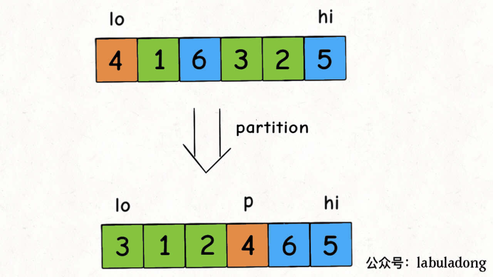

# 快排亲兄弟：快速选择算法详解

快速选择算法是一个非常经典的算法，和快速排序算法是亲兄弟。

原始题目很简单，给你输入一个无序的数组`nums`和一个正整数`k`，让你计算`nums`中第`k`大的元素。

那你肯定说，给`nums`数组排个序，然后取第`k`个元素，也就是`nums[k-1]`，不就行了吗？

当然可以，但是排序时间复杂度是`O(NlogN)`，其中`N`表示数组`nums`的长度。

我们就想要第`k`大的元素，却给整个数组排序，有点杀鸡用牛刀的感觉，所以这里就有一些小技巧了，可以把时间复杂度降低到`O(NlogK)`甚至是`O(N)`，下面我们就来具体讲讲。

力扣第 215 题「数组中的第 K 个最大元素」就是一道类似的题目，函数签名如下：

```
int findKthLargest(int[] nums, int k);
```

只不过题目要求找**第k个最大的元素**，和我们刚才说的**第k大的元素**在语义上不太一样，题目的意思相当于是把`nums`数组降序排列，然后返回第`k`个元素。

比如输入`nums = [2,1,5,4], k = 2`，算法应该返回 4，因为 4 是`nums`中第 2 个**最大**的元素。

这种问题有两种解法，一种是二叉堆（优先队列）的解法，另一种就是标题说到的快速选择算法（Quick Select），我们分别来看。

### 二叉堆解法

**二叉堆的解法比较简单，实际写算法题的时候，推荐大家写这种解法**，先直接看代码吧：

```
int findKthLargest(int[] nums, int k) {
    // 小顶堆，堆顶是最小元素
    PriorityQueue<Integer> 
        pq = new PriorityQueue<>();
    for (int e : nums) {
        // 每个元素都要过一遍二叉堆
        pq.offer(e);
        // 堆中元素多于 k 个时，删除堆顶元素
        if (pq.size() > k) {
            pq.poll();
        }
    }
    // pq 中剩下的是 nums 中 k 个最大元素，
    // 堆顶是最小的那个，即第 k 个最大元素
    return pq.peek();
}
```

二叉堆（优先队列）是比较常见的数据结构，可以认为它会自动排序，我们前文 手把手实现二叉堆数据结构 实现过这种结构，我就默认大家熟悉它的特性了。

看代码应该不难理解，可以把小顶堆`pq`理解成一个筛子，较大的元素会沉淀下去，较小的元素会浮上来；当堆大小超过`k`的时候，我们就删掉堆顶的元素，因为这些元素比较小，而我们想要的是前`k`个最大元素嘛。当`nums`中的所有元素都过了一遍之后，筛子里面留下的就是最大的`k`个元素，而堆顶元素是堆中最小的元素，也就是「第`k`个最大的元素」。

二叉堆插入和删除的时间复杂度和堆中的元素个数有关，在这里我们堆的大小不会超过`k`，所以插入和删除元素的复杂度是`O(logK)`，再套一层 for 循环，总的时间复杂度就是`O(NlogK)`。空间复杂度很显然就是二叉堆的大小，为`O(K)`。

这个解法算是比较简单的吧，代码少也不容易出错，所以说如果笔试面试中出现类似的问题，建议用这种解法。唯一注意的是，Java 的`PriorityQueue`默认实现是小顶堆，有的语言的优先队列可能默认是大顶堆，可能需要做一些调整。

### 快速选择算法

**快速选择算法比较巧妙，时间复杂度更低，是快速排序的简化版，一定要熟悉思路**。

我们先从快速排序讲起。

快速排序的逻辑是，若要对`nums[lo..hi]`进行排序，我们先找一个分界点`p`，通过交换元素使得`nums[lo..p-1]`都小于等于`nums[p]`，且`nums[p+1..hi]`都大于`nums[p]`，然后递归地去`nums[lo..p-1]`和`nums[p+1..hi]`中寻找新的分界点，最后整个数组就被排序了。

快速排序的代码如下：

```
/* 快速排序主函数 */
void sort(int[] nums) {
    // 一般要在这用洗牌算法将 nums 数组打乱，
    // 以保证较高的效率，我们暂时省略这个细节
    sort(nums, 0, nums.length - 1);
}

/* 快速排序核心逻辑 */
void sort(int[] nums, int lo, int hi) {
    if (lo >= hi) return;
    // 通过交换元素构建分界点索引 p
    int p = partition(nums, lo, hi);
    // 现在 nums[lo..p-1] 都小于 nums[p]，
    // 且 nums[p+1..hi] 都大于 nums[p]
    sort(nums, lo, p - 1);
    sort(nums, p + 1, hi);
}
```

关键就在于这个分界点索引`p`的确定，我们画个图看下`partition`函数有什么功效：



**索引p左侧的元素都比nums[p]小，右侧的元素都比nums[p]大，意味着这个元素已经放到了正确的位置上**，回顾快速排序的逻辑，递归调用会把`nums[p]`之外的元素也都放到正确的位置上，从而实现整个数组排序，这就是快速排序的核心逻辑。

那么这个`partition`函数如何实现的呢？看下代码：

```
int partition(int[] nums, int lo, int hi) {
    if (lo == hi) return lo;
    // 将 nums[lo] 作为默认分界点 pivot
    int pivot = nums[lo];
    // j = hi + 1 因为 while 中会先执行 --
    int i = lo, j = hi + 1;
    while (true) {
        // 保证 nums[lo..i] 都小于 pivot
        while (nums[++i] < pivot) {
            if (i == hi) break;
        }
        // 保证 nums[j..hi] 都大于 pivot
        while (nums[--j] > pivot) {
            if (j == lo) break;
        }
        if (i >= j) break;
        // 如果走到这里，一定有：
        // nums[i] > pivot && nums[j] < pivot
        // 所以需要交换 nums[i] 和 nums[j]，
        // 保证 nums[lo..i] < pivot < nums[j..hi]
        swap(nums, i, j);
    }
    // 将 pivot 值交换到正确的位置
    swap(nums, j, lo);
    // 现在 nums[lo..j-1] < nums[j] < nums[j+1..hi]
    return j;
}

// 交换数组中的两个元素
void swap(int[] nums, int i, int j) {
    int temp = nums[i];
    nums[i] = nums[j];
    nums[j] = temp;
}
```

熟悉快速排序逻辑的读者应该可以理解这段代码的含义了，这个`partition`函数细节较多，上述代码参考《算法4》，是众多写法中最漂亮简洁的一种，所以建议背住，这里就不展开解释了。

好了，对于快速排序的探讨到此结束，我们回到一开始的问题，寻找第`k`大的元素，和快速排序有什么关系？

注意这段代码：

```
int p = partition(nums, lo, hi);
```

我们刚说了，`partition`函数会将`nums[p]`排到正确的位置，使得`nums[lo..p-1] < nums[p] < nums[p+1..hi]`。

**那么我们可以把p和k进行比较，如果p < k说明第k大的元素在nums[p+1..hi]中，如果p > k说明第k大的元素在nums[lo..p-1]中**。

所以我们可以复用`partition`函数来实现这道题目，不过在这之前还是要做一下索引转化：

题目要求的是「第`k`个最大元素」，这个元素其实就是`nums`升序排序后「索引」为`len(nums) - k`的这个元素。

这样就可以写出解法代码：

```
int findKthLargest(int[] nums, int k) {
    int lo = 0, hi = nums.length - 1;
    // 索引转化
    k = nums.length - k;
    while (lo <= hi) {
        // 在 nums[lo..hi] 中选一个分界点
        int p = partition(nums, lo, hi);
        if (p < k) {
            // 第 k 大的元素在 nums[p+1..hi] 中
            lo = p + 1;
        } else if (p > k) {
            // 第 k 大的元素在 nums[lo..p-1] 中
            hi = p - 1;
        } else {
            // 找到第 k 大元素
            return nums[p];
        }
    }
    return -1;
}
```

这个代码框架其实非常像我们前文 [二分搜索框架](http://mp.weixin.qq.com/s?__biz=MzAxODQxMDM0Mw==&mid=2247485044&idx=1&sn=e6b95782141c17abe206bfe2323a4226&chksm=9bd7f87caca0716aa5add0ddddce0bfe06f1f878aafb35113644ebf0cf0bfe51659da1c1b733&scene=21#wechat_redirect) 的代码，这也是这个算法高效的原因，但是时间复杂度为什么是`O(N)`呢？按理说类似二分搜索的逻辑，时间复杂度应该一定会出现对数才对呀？

其实这个`O(N)`的时间复杂度是个均摊复杂度，因为我们的`partition`函数中需要利用 [双指针技巧](http://mp.weixin.qq.com/s?__biz=MzAxODQxMDM0Mw==&mid=2247488584&idx=1&sn=90f7956fd9d8320fcb81aaf33c3fe7f1&chksm=9bd7ea40aca06356cdb87ba86518c50646b48b8534d42625ba454c084187400b979c8d736a61&scene=21#wechat_redirect) 遍历`nums[lo..hi]`，那么总共遍历了多少元素呢？

最好情况下，每次`p`都恰好是正中间`(lo + hi) / 2`，那么遍历的元素总数就是：

N + N/2 + N/4 + N/8 + … + 1

这就是等比数列求和公式嘛，求个极限就等于`2N`，所以遍历元素个数为`2N`，时间复杂度为`O(N)`。

但我们其实不能保证每次`p`都是正中间的索引的，最坏情况下`p`一直都是`lo + 1`或者一直都是`hi - 1`，遍历的元素总数就是：

N + (N - 1) + (N - 2) + … + 1

这就是个等差数列求和，时间复杂度会退化到`O(N^2)`，**为了尽可能防止极端情况发生，我们需要在算法开始的时候对nums数组来一次随机打乱**：

```
int findKthLargest(int[] nums, int k) {
    // 首先随机打乱数组
    shuffle(nums);
    // 其他都不变
    int lo = 0, hi = nums.length - 1;
    k = nums.length - k;
    while (lo <= hi) {
        // ...
    }
    return -1;
}

// 对数组元素进行随机打乱
void shuffle(int[] nums) {
    int n = nums.length;
    Random rand = new Random();
    for (int i = 0 ; i < n; i++) {
        // 从 i 到最后随机选一个元素
        int r = i + rand.nextInt(n - i);
        swap(nums, i, r);
    }
}
```

前文 [洗牌算法详解](http://mp.weixin.qq.com/s?__biz=MzAxODQxMDM0Mw==&mid=2247484503&idx=1&sn=e30ef74eb16ad385c16681cd6dfe15cf&chksm=9bd7fa5faca07349c6877bc69f9a27e13585f2c5ed2237ad37ac5b272611039391acc1dcd33d&scene=21#wechat_redirect) 写过随机乱置算法，这里就不展开了。当你加上这段代码之后，平均时间复杂度就是`O(N)`了，提交代码后运行速度大幅提升。

总结一下，快速选择算法就是快速排序的简化版，复用了partition函数，快速定位第 k 大的元素。相当于对数组部分排序而不需要完全排序，从而提高算法效率，将平均时间复杂度降到O(N)。