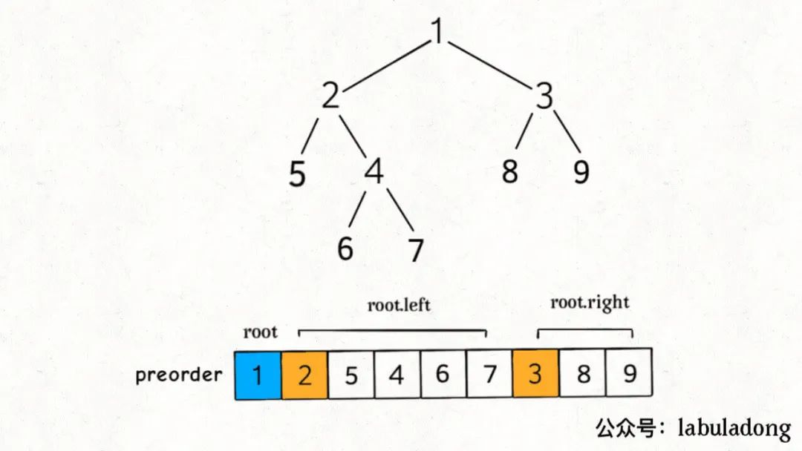
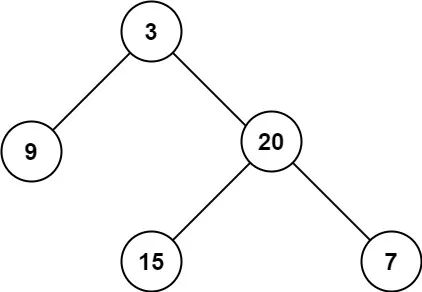
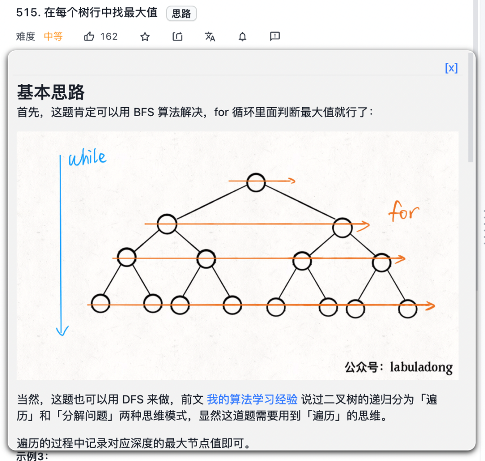
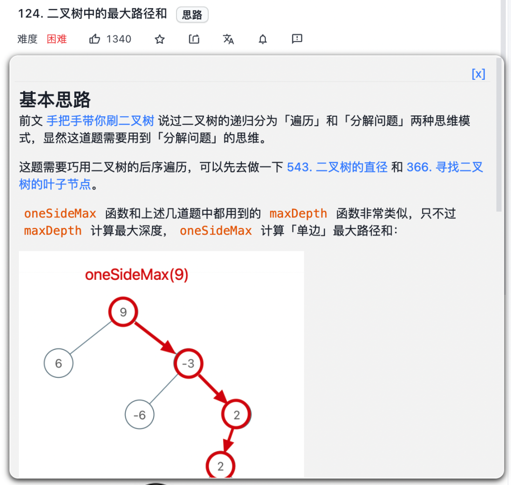

# 手把手刷二叉树系列完结篇

本文是最后完结篇，对上述文章进行总结，无论你是否看过上述几篇文章，看完本文再去看它们都会对二叉树和递归有更深的认识。

另外，本文中会用题目来举例，但都是最最简单的题目，所谓大道至简，就算基础比较差也不用担心自己看不懂。

我可以帮你从最简单的问题中提炼出所有二叉树题目的共性，并将这些思维反手用到 [动态规划](https://mp.weixin.qq.com/s?__biz=MzAxODQxMDM0Mw==&mid=2247484731&idx=1&sn=f1db6dee2c8e70c42240aead9fd224e6&scene=21#wechat_redirect)，[回溯算法](https://mp.weixin.qq.com/s?__biz=MzAxODQxMDM0Mw==&mid=2247484709&idx=1&sn=1c24a5c41a5a255000532e83f38f2ce4&scene=21#wechat_redirect)，[分治算法](https://mp.weixin.qq.com/s?__biz=MzAxODQxMDM0Mw==&mid=2247488970&idx=1&sn=d4eb6a371f1706d76e370be18b27afb4&scene=21#wechat_redirect)，[图论算法](https://mp.weixin.qq.com/s?__biz=MzAxODQxMDM0Mw==&mid=2247494624&idx=1&sn=29b84ce2a1ba8115922179e207281e27&scene=21#wechat_redirect) 中去，这也是我一直强调框架思维的原因。

### 深入理解前中后序

之前二叉树的文章，总有读者留言说看不出解法应该用前序中序还是后序，其实原因是你对前中后序的理解还不到位，这里我简单解释一下。

首先，先回顾一下 [学习数据结构和算法的框架思维](https://mp.weixin.qq.com/s?__biz=MzAxODQxMDM0Mw==&mid=2247484852&idx=1&sn=85b50b8b0470bb4897e517955f4e5002&scene=21#wechat_redirect) 中说到的二叉树遍历框架：

```
void traverse(TreeNode root) {
    if (root == null) {
        return;
    }
    // 前序位置
    traverse(root.left);
    // 中序位置
    traverse(root.right);
    // 后序位置
}
```

先不管所谓前中后序，单看这段代码是什么？

其实就是一个能够遍历二叉树所有节点的一个函数，和你遍历数组或者链表本质上没有区别：

```
/* 迭代遍历数组 */
void traverse(int[] arr) {
    for (int i = 0; i < arr.length; i++) {

    }
}

/* 递归遍历数组 */
void traverse(int[] arr, int i) {
    if (i == arr.length) {
        return;
    }
    // 前序位置
    traverse(arr, i + 1);
    // 后序位置
}

/* 迭代遍历单链表 */
void traverse(ListNode head) {
    for (ListNode p = head; p != null; p = p.next) {

    }
}

/* 递归遍历单链表 */
void traverse(ListNode head) {
    if (head == null) {
        return;
    }
    // 前序位置
    traverse(head.next);
    // 后序位置
}
```

单链表和数组的遍历可以是迭代的，也可以是递归的，二叉树这种结构无非就是二叉链表，不过没办法简单改写成迭代形式，所以一般说二叉树的遍历框架都是指递归的形式。

你也注意到了，只要是递归形式的遍历，都会有一个前序和后序位置，分别在递归之前和之后。

所谓前序位置，就是刚进入一个节点（元素）的时候，后序位置就是即将离开一个节点（元素）的时候。

**你把代码写在不同位置，代码执行的时机也不同**：



比如说，如果让你**倒序打印**一条单链表上所有节点的值，你怎么搞？

实现方式当然有很多，但如果你对递归的理解足够透彻，可以利用后序位置：

```
/* 递归遍历单链表，倒序打印链表元素 */
void traverse(ListNode head) {
    if (head == null) {
        return;
    }
    traverse(head.next);
    // 后序位置
    print(head.val);
}
```

结合上面那张图，你应该知道为什么这段代码能够倒序打印单链表了吧，本质上是利用递归的堆栈帮你实现了倒序遍历的效果。

那么说回二叉树也是一样的，只不过多了一个中序位置罢了。

这里我强调一个初学者经常犯的错误：因为教科书里只会问你前中后序遍历结果分别是什么，所以对于一个只上过大学数据结构课程的人来说，他大概以为二叉树的前中后序只不过对应三种顺序不同的`List<Integer>`列表。

但是我想说，**前中后序是遍历二叉树过程中处理每一个节点的三个特殊时间点**，绝不仅仅是三个顺序不同的 List：

前序位置的代码在刚刚进入一个二叉树节点的时候执行；

后序位置的代码在将要离开一个二叉树节点的时候执行；

中序位置的代码在一个二叉树节点左子树都遍历完，即将开始遍历右子树的时候执行。

你注意本文的用词，我一直说前中后序「位置」，就是要和大家常说的前中后序「遍历」有所区别：你可以在前序位置写代码往一个 List 里面塞元素，那最后可以得到前序遍历结果；但并不是说你就不可以写更复杂的代码做更复杂的事。

画成图，前中后序三个位置在二叉树上是这样：


你可以发现**每个节点都有「唯一」属于自己的前中后序位置**，所以我说前中后序遍历是遍历二叉树过程中处理每一个节点的三个特殊时间点。

这里你也可以理解为什么多叉树没有中序位置，因为二叉树的每个节点只会进行唯一一次左子树切换右子树，而多叉树节点可能有很多子节点，会多次切换子树去遍历，所以多叉树节点没有「唯一」的中序遍历位置。

说了这么多基础的，就是要帮你对二叉树建立正确的认识，然后你会发现：**二叉树的所有问题，就是让你在前中后序位置注入巧妙的代码逻辑，去达到自己的目的**。

这也就是之前 6 篇手把手刷二叉树文章的核心思想：你只需要思考每一个节点应该做什么，其他的不用你管，抛给二叉树遍历框架，递归会对所有节点做相同的操作。

你也可以看到，[图论算法基础](https://mp.weixin.qq.com/s?__biz=MzAxODQxMDM0Mw==&mid=2247494624&idx=1&sn=29b84ce2a1ba8115922179e207281e27&scene=21#wechat_redirect) 把二叉树的遍历框架扩展到了图，并以遍历为基础实现了图论的各种经典算法，不过这是后话，本文就不多说了。

### 两种解题思路

前文 [我的算法学习心得](https://mp.weixin.qq.com/s?__biz=MzAxODQxMDM0Mw==&mid=2247492216&idx=1&sn=36ae4ac33640cc3814186b75d6c8d368&scene=21#wechat_redirect) 说过，**二叉树题目的递归解法可以分两类思路，第一类是遍历一遍二叉树得出答案，第二类是通过分解问题计算出答案，这两类思路分别对应着 回溯算法核心框架 和 动态规划核心框架**。

当时我是用二叉树的最大深度这个问题来举例，重点在于把这两种思路和动态规划和回溯算法进行对比，而本文的重点在于分析这两种思路如何解决二叉树的题目。

力扣第 104 题「二叉树的最大深度」就是最大深度的题目，所谓最大深度就是根节点到「最远」叶子节点的最长路径上的节点数，比如输入这棵二叉树，算法应该返回 3：



你做这题的思路是什么？显然遍历一遍二叉树，用一个外部变量记录每个节点所在的深度，取最大值就可以得到最大深度，**这就是遍历二叉树计算答案的思路**。

解法代码如下：

```
// 记录最大深度
int res = 0;
// 记录遍历到的节点的深度
int depth = 0;

// 主函数
int maxDepth(TreeNode root) {
    traverse(root);
    return res;
}

// 二叉树遍历框架
void traverse(TreeNode root) {
    if (root == null) {
        // 到达叶子节点，更新最大深度
        res = Math.max(res, depth);
        return;
    }
    // 前序位置
    depth++;
    traverse(root.left);
    traverse(root.right);
    // 后序位置
    depth--;
}
```

这个解法应该很好理解，但为什么需要在前序位置增加`depth`，在后序位置减小`depth`？

因为前面说了，前序位置是进入一个节点的时候，后序位置是离开一个节点的时候，`depth`记录当前递归到的节点深度，所以要这样维护。

当然，你也很容易发现一棵二叉树的最大深度可以通过子树的最大高度推导出来，**这就是分解问题计算答案的思路**。

解法代码如下：

```
// 定义：输入根节点，返回这棵二叉树的最大深度
int maxDepth(TreeNode root) {
    if (root == null) {
        return 0;
    }
    // 利用定义，计算左右子树的最大深度
    int leftMax = maxDepth(root.left);
    int rightMax = maxDepth(root.right);
    // 整棵树的最大深度等于左右子树的最大深度取最大值，
    // 然后再加上根节点自己
    int res = Math.max(leftMax, rightMax) + 1;

    return res;
}
```

只要明确递归函数的定义，这个解法也不难理解，但为什么主要的代码逻辑集中在后序位置？

因为这个思路正确的核心在于，你确实可以通过子树的最大高度推导出原树的高度，所以当然要首先利用递归函数的定义算出左右子树的最大深度，然后推出原树的最大深度，主要逻辑自然放在后序位置。

如果你理解了最大深度这个问题的两种思路，**那么我们再回头看看最基本的二叉树前中后序遍历**，就比如算前序遍历结果吧。

我们熟悉的解法就是用「遍历」的思路，我想应该没什么好说的：

```
List<Integer> res = new LinkedList<>();

// 返回前序遍历结果
List<Integer> preorderTraverse(TreeNode root) {
    traverse(root);
    return res;
}

// 二叉树遍历函数
void traverse(TreeNode root) {
    if (root == null) {
        return;
    }
    // 前序位置
    res.add(root.val);
    traverse(root.left);
    traverse(root.right);
}
```

但你是否能够用「分解问题」的思路，来计算前序遍历的结果？

换句话说，不要用像`traverse`这样的辅助函数和任何外部变量，单纯用题目给的`preorderTraverse`函数递归解题，你会不会？

我们知道前序遍历的特点是，根节点的值排在首位，接着是左子树的前序遍历结果，最后是右子树的前序遍历结果：


那这不就可以分解问题了么，**一棵二叉树的前序遍历分解成了根节点和左右子树的前序遍历结果**。

所以，你可以这样实现前序遍历算法：

```
// 定义：输入一棵二叉树的根节点，返回这棵树的前序遍历结果
List<Integer> preorderTraverse(TreeNode root) {
    List<Integer> res = new LinkedList<>();
    if (root == null) {
        return res;
    }
    // 前序遍历的结果，root.val 在第一个
    res.add(root.val);
    // 利用函数定义，后面接着左子树的前序遍历结果
    res.addAll(preorderTraverse(root.left));
    // 利用函数定义，最后接着右子树的前序遍历结果
    res.addAll(preorderTraverse(root.right));
}
```

中序和后序遍历也是类似的，只要把`add(root.val)`放到中序和后序对应的位置就行了。

这个解法短小精干，但为什么不常见呢？

一个原因是**这个算法的复杂度不好把控**，比较依赖语言特性。

Java 的话，无论 ArrayList 还是 LinkedList，`addAll`方法的复杂度都是 O(N)，所以总体的最坏时间复杂度会达到 O(N^2)，除非你自己实现一个复杂度为 O(1) 的`addAll`方法，底层用链表的话并不是不可能。

当然，最主要的原因还是因为教科书上从来没有这么教过……

上文举了两个简单的例子，但还有不少二叉树的题目是可以同时使用两种思路来思考和求解的，这就要靠你自己多去练习和思考，不要仅仅满足于一种熟悉的解法思路。

综上，遇到一道二叉树的题目时的通用思考过程是：

**是否可以通过遍历一遍二叉树得到答案？如果不能的话，是否可以定义一个递归函数，通过子问题（子树）的答案推导出原问题的答案**？

**我的刷题插件 更新了所有值得一做的二叉树题目思路，全部归类为上述两种思路**，你如果按照插件提供的思路解法过一遍二叉树的所有题目，不仅可以完全掌握递归思维，而且可以更容易理解高级的算法：



### 后序位置的特殊之处

说后序位置之前，先简单说下中序和前序。

中序位置主要用在 BST 场景中，你完全可以把 BST 的中序遍历认为是遍历有序数组。

前序位置本身其实没有什么特别的性质，之所以你发现好像很多题都是在前序位置写代码，实际上是因为我们习惯把那些对前中后序位置不敏感的代码写在前序位置罢了。

接下来主要说下后序位置，和前序位置对比，发现前序位置的代码执行是自顶向下的，而后序位置的代码执行是自底向上的：


这不奇怪，因为本文开头就说了前序位置是刚刚进入节点的时刻，后序位置是即将离开节点的时刻。

**但这里面大有玄妙，意味着前序位置的代码只能从函数参数中获取父节点传递来的数据，而后序位置的代码不仅可以获取参数数据，还可以获取到子树通过函数返回值传递回来的数据**。

举具体的例子，现在给你一棵二叉树，我问你两个简单的问题：

1、如果把根节点看做第 1 层，如何打印出每一个节点所在的层数？

2、如何打印出每个节点的左右子树各有多少节点？

第一个问题可以这样写代码：

```
// 二叉树遍历函数
void traverse(TreeNode root, int level) {
    if (root == null) {
        return;
    }
    // 前序位置
    printf("节点 %s 在第 %d 层", root, level);
    traverse(root.left, level + 1);
    traverse(root.right, level + 1);
}

// 这样调用
traverse(root, 1);
```

第二个问题可以这样写代码：

```
// 定义：输入一棵二叉树，返回这棵二叉树的节点总数
int count(TreeNode root) {
    if (root == null) {
        return 0;
    }
    int leftCount = count(root.left);
    int rightCount = count(root.right);
    // 后序位置
    printf("节点 %s 的左子树有 %d 个节点，右子树有 %d 个节点",
            root, leftCount, rightCount);

    return leftCount + rightCount + 1;
}
```

结合这两个简单的问题，你品味一下后序位置的特点，只有后序位置才能通过返回值获取子树的信息。

**那么换句话说，一旦你发现题目和子树有关，那大概率要给函数设置合理的定义和返回值，在后序位置写代码了**。

接下来看下后序位置是如何在实际的题目中发挥作用的，简单聊下力扣第 543 题「二叉树的直径」，让你计算一棵二叉树的最长「直径」长度。

所谓二叉树的「直径」长度，就是任意两个结点之间的路径长度。最长「直径」并不一定要穿过根结点，比如下面这棵二叉树：


它的直径是 3，即`[4,2,1,3]`或者`[5,2,1,3]`这两条路径的长度。

解决这题的关键在于，**每一条二叉树的「直径」长度就是一个节点的左右子树的最大深度之和**。

现在让我求整棵树中的最长「直径」，那直截了当的思路就是遍历整棵树中的每个节点，然后通过每个节点的左右子树的最大深度算出每个节点的「直径」，最后把所有「直径」求个最大值即可。

最大深度的算法我们刚才实现过了，上述思路就可以写出以下代码：

```
// 记录最大直径的长度
int maxDiameter = 0;

public int diameterOfBinaryTree(TreeNode root) {
    // 对每个节点计算直径，求最大直径
    traverse(root);
    return maxDiameter;
}

// 遍历二叉树
void traverse(TreeNode root) {
    if (root == null) {
        return;
    }
    // 对每个节点计算直径
    int leftMax = maxDepth(root.left);
    int rightMax = maxDepth(root.right);
    int myDiameter = leftMax + rightMax;
    // 更新全局最大直径
    maxDiameter = Math.max(maxDiameter, myDiameter);

    traverse(root.left);
    traverse(root.right);
}

// 计算二叉树的最大深度
int maxDepth(TreeNode root) {
    if (root == null) {
        return 0;
    }
    int leftMax = maxDepth(root.left);
    int rightMax = maxDepth(root.right);
    return 1 + Math.max(leftMax, rightMax);
}
```

这个解法是正确的，但是运行时间很长，原因也很明显，`traverse`遍历每个节点的时候还会调用递归函数`maxDepth`，而`maxDepth`是要遍历所有子树的，所以最坏时间复杂度是 O(N^2)。

这就出现了刚才探讨的情况，**前序位置无法获取子树信息，所以只能让每个节点调用maxDepth函数去算子树的深度**。

那如何优化？我们应该把计算「直径」的逻辑放在后序位置，准确说应该是放在`maxDepth`的后序位置，因为`maxDepth`的后序位置是知道左右子树的最大深度的。

所以，稍微改一下代码逻辑即可得到更好的解法：

```
// 记录最大直径的长度
int maxDiameter = 0;

public int diameterOfBinaryTree(TreeNode root) {
    maxDepth(root);
    return maxDiameter;
}

int maxDepth(TreeNode root) {
    if (root == null) {
        return 0;
    }
    int leftMax = maxDepth(root.left);
    int rightMax = maxDepth(root.right);
    // 后序位置顺便计算最大直径
    int myDiameter = leftMax + rightMax;
    maxDiameter = Math.max(maxDiameter, myDiameter);

    return 1 + Math.max(leftMax, rightMax);
}
```

这下时间复杂度只有`maxDepth`函数的 O(N) 了。

讲到这里，照应一下前文：遇到子树问题，首先想到的是给函数设置返回值，然后在后序位置做文章。

反过来，如果你写出了类似一开始的那种递归套递归的解法，大概率也需要反思是不是可以通过后序遍历优化了。

**我的刷题插件对于这类考察后序遍历的题目也有特殊的说明**，并且会给出前置题目，帮助你由浅入深理解这类题目：



### 层序遍历

二叉树题型主要是用来培养递归思维的，而层序遍历属于迭代遍历，也比较简单，这里就过一下代码框架吧：

```
// 输入一棵二叉树的根节点，层序遍历这棵二叉树
void levelTraverse(TreeNode root) {
    if (root == null) return;
    Queue<TreeNode> q = new LinkedList<>();
    q.offer(root);

    // 从上到下遍历二叉树的每一层
    while (!q.isEmpty()) {
        int sz = q.size();
        // 从左到右遍历每一层的每个节点
        for (int i = 0; i < sz; i++) {
            TreeNode cur = q.poll();
            // 将下一层节点放入队列
            if (cur.left != null) {
                q.offer(cur.left);
            }
            if (cur.right != null) {
                q.offer(cur.right);
            }
        }
    }
}
```

这里面 while 循环和 for 循环分管从上到下和从左到右的遍历：


前文 [BFS 算法框架](https://mp.weixin.qq.com/s?__biz=MzAxODQxMDM0Mw==&mid=2247485134&idx=1&sn=fd345f8a93dc4444bcc65c57bb46fc35&scene=21#wechat_redirect) 就是从二叉树的层序遍历扩展出来的，常用于求无权图的**最短路径**问题。

当然这个框架还可以灵活修改，题目不需要记录层数（步数）时可以去掉上述框架中的 for 循环，比如前文 [Dijkstra 算法](https://mp.weixin.qq.com/s?__biz=MzAxODQxMDM0Mw==&mid=2247492167&idx=1&sn=bc96c8f97252afdb3973c7d760edb9c0&scene=21#wechat_redirect) 中计算加权图的最短路径问题，详细探讨了 BFS 算法的扩展。

值得一提的是，有些很明显需要用层序遍历技巧的二叉树的题目，也可以用递归遍历的方式去解决，而且技巧性会更强，非常考察你对前中后序的把控。

对于这类问题，[我的刷题插件](https://mp.weixin.qq.com/s?__biz=MzAxODQxMDM0Mw==&mid=2247494527&idx=1&sn=c8b729bcc045cef066c4b1f36e8855bc&scene=21#wechat_redirect)也会同时提供递归遍历和层序遍历的解法代码：


好了，本文已经够长了，围绕前中后序位置算是把二叉树题目里的各种套路给讲透了，真正能运用出来多少，就需要你亲自刷题实践和思考了。

希望大家能探索尽可能多的解法，只要参透二叉树这种基本数据结构的原理，那么就很容易在学习其他高级算法的道路上找到抓手，打通回路，形成闭环（手动狗头）。